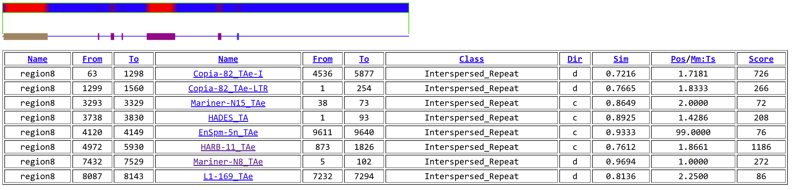
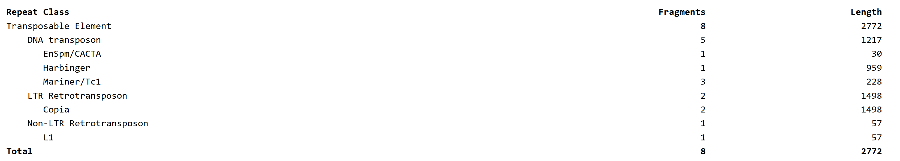
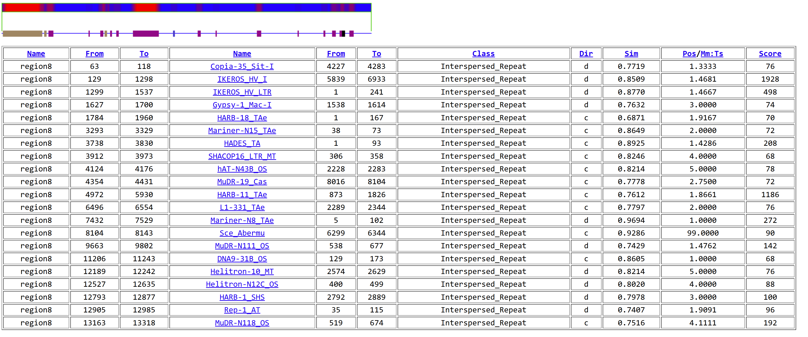
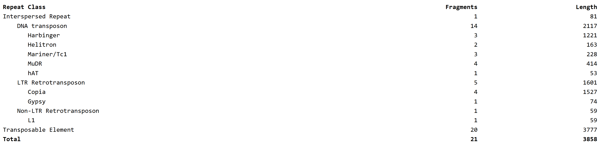
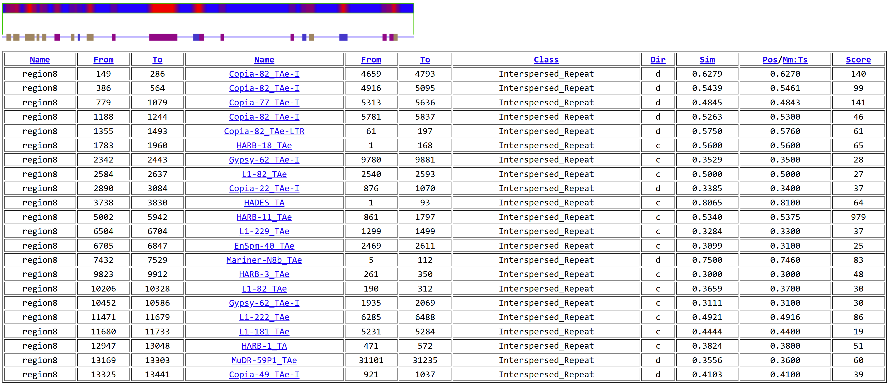
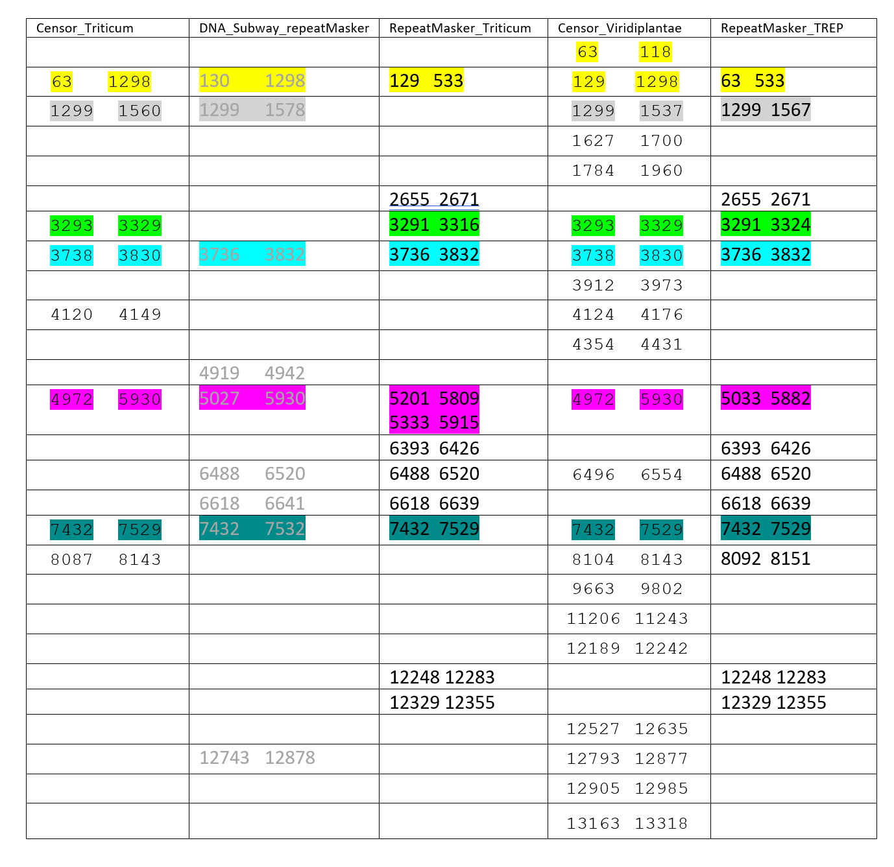
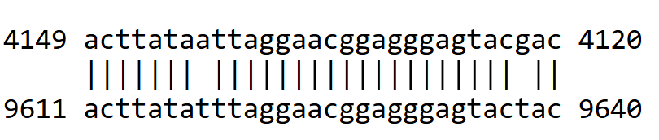

To detect transposable elements (TEs) in the genomic region of *Triticum aestivum* (wheat), we used the following tools:

- RepeatMasker software with the TREP database considering first the Triticum genus only and then the complete database.
- Censor from Genetic Information Research Institute (GIRI) website, considering first the Triticum genus and then the Viridiplantae.
- RepeatMasker included in DNA Subway.

## RepeatMasker

[RepeatMasker Website](https://www.repeatmasker.org/RepeatMasker/)

RepeatMasker is a program that screens DNA sequences for interspersed repeats and low complexity DNA sequences. It can be used to identify transposable elements (TEs) in genomic sequences.

### Prerequisites

1. **Perl**:

    Verify that Perl version 5.8.0 or higher is installed:
    ```bash
    perl -v
    ```
    If not installed, run:
    ```bash
    sudo apt update
    sudo apt install perl
    ```

2. **Python 3 and h5py Library**:

    Verify that Python 3 is installed:
    ```bash
    python3 --version
    ```
    Then, install the `h5py` library:
    ```bash
    sudo apt install h5py
    ```

3. **Sequence Search Engine: RMBlast**:

    We will use **RMBlast**, a RepeatMasker-specific version of NCBI BLAST, which is optimized for repeat detection and recommended for use with RepeatMasker, particularly for complex genomes like *Triticum aestivum* ([RMBlast Website](https://www.repeatmasker.org/rmblast)).

    Download RMBlast:
    ```bash
    wget https://www.repeatmasker.org/rmblast/rmblast-2.14.1+-x64-linux.tar.gz
    ```
    Extract and move it to the system's PATH:
    ```bash
    tar zxvf rmblast-2.14.1+-x64-linux.tar.gz
    sudo mv rmblast-2.14.1 /usr/local/bin/rmblast
    ```
    Remove the downloaded tar file:
    ```bash
    rm rmblast-2.14.1+-x64-linux.tar.gz
    ```

4. **Tandem Repeat Finder (TRF)**:  

    Download TRF:
    ```bash
    wget https://github.com/Benson-Genomics-Lab/TRF/releases/download/v4.09.1/trf409.linux64
    ```
    Make the file executable and move it to the system's PATH:
    ```bash
    chmod +x trf409.linux64
    sudo mv trf409.linux64 /usr/local/bin/trf
    ```

---

### Installation

1. **Download RepeatMasker**:  

    The latest version is **RepeatMasker-4.1.7-p1.tar.gz**. To download the file in the /usr/local directory:
    ```bash
    cd /usr/local/
    sudo wget https://www.repeatmasker.org/RepeatMasker/RepeatMasker-4.1.7-p1.tar.gz
    ```

2. **Unpack the Distribution**:  

    Unpacking it to `/usr/local/` directory:
    ```bash
    sudo gunzip RepeatMasker-4.1.7-p1.tar.gz
    sudo tar xvf RepeatMasker-4.1.7-p1.tar
    sudo rm RepeatMasker-4.1.7-p1.tar
    ```

3. **Run the Configure Script**:  

    ```bash
    cd /usr/local/RepeatMasker
    sudo perl ./configure
    ```

4. **Install RepeatMasker Libraries**:  

    We installed Dfam Viridiplantae partition database but it required a lot of space and time to use. Also, for the RepBase database it requires subscription. So we will use the **TREP Database**.

    **TREP Database**:

    TRansposable Elements Platform (TREP) is a curated collection of transposable elements (TEs) originally focused on **Triticeae species** (wheat, barley, maize), but has expanded to include TEs from various other species. This database is essential for identifying, classifying, and masking TEs in genomic sequences ([TREP Database](https://trep-db.uzh.ch)).

    To download the necessary TREP database files:

    1. **Triticum sequences**  
        This database contains sequences specific to *Triticum* genus.
        ```bash
        sudo wget https://trep-db.uzh.ch/blast/dir_download/sequences.zip -P /usr/local/RepeatMasker/Libraries/
        ```

    2. **Complete TREP nucleotide sequence database (4,162 sequences)**  
        This database includes all TE entries for detailed analysis.
        ```bash
        sudo wget https://trep-db.uzh.ch/downloads/trep-db_complete_Rel-19.fasta.gz -P /usr/local/RepeatMasker/Libraries/
        ```

    To extract the files:

    ```bash
    cd /usr/local/RepeatMasker/Libraries/
    sudo unzip sequences.zip
    sudo gunzip trep-db_complete_Rel-19.fasta.gz
    ```

---

### Usage

1. **RepeatMasker with Triticum sequences from TREP database:** 

    ```bash
    RepeatMasker -lib /usr/local/RepeatMasker/Libraries/sequences.fasta \
                -dir /home/joelle/M1/Structural_Genomics/triticum_sequences \
                /home/joelle/M1/Structural_Genomics/region8.fasta.txt
    ```
    `-lib`: Specifies the library file to use for masking.   
    `-dir`: Specifies the output directory for the results.  
    `-region8.fasta.txt`: The input file containing the genomic sequence to analyze.  

    The output file region8.fasta.txt.out contains the following information:

    | SW score | perc div. | perc del. | perc ins. | query sequence | position in query (begin - end) | matching repeat                       | repeat class/family      | position in repeat (begin - end) | ID  |
    |----------|-----------|-----------|-----------|----------------|----------------------------------|---------------------------------------|--------------------------|-----------------------------------|------|
    | 406      | 33.0      | 7.2       | 1.4       | region8        | 129 - 533                       | RLC_Taes_Ida_EF540321-1               | Unspecified              | 3537 - 3964 (126)               | 1    |
    | 16       | 0.0       | 0.0       | 0.0       | region8        | 2655 - 2671                     | (T)n                                  | Simple_repeat            | 1 - 17 (0)                      | 2    |
    | 229      | 0.0       | 0.0       | 0.0       | region8        | 3291 - 3316                     | DTT_Taes_SBB_42j2-2                   | Unspecified              | 9 - 34 (51)                     | 3    |
    | 811      | 3.1       | 0.0       | 0.0       | region8        | 3736 - 3832                     | DTT_Taes_Hades_42j2-4                 | Unspecified              | 1 - 97 (0)                      | 4    |
    | 1032     | 30.8      | 3.9       | 4.5       | region8        | 5201 - 5809                     | DTH_Taes_Rong_AY951945-1              | Unspecified (C)          | 702 - 1716 (1111)               | 5    |
    | 1060     | 33.8      | 1.7       | 1.5       | region8        | 5333 - 5915                     | DTH_Tmon_unnamed_AY914080-1           | Unspecified (C)          | 7 - 1243 (660)                  | 6    |
    | 14       | 12.8      | 5.9       | 0.0       | region8        | 6393 - 6426                     | (CTCC)n                               | Simple_repeat            | 1 - 36 (0)                      | 7    |
    | 18       | 13.3      | 0.0       | 0.0       | region8        | 6488 - 6520                     | (GGGTC)n                              | Simple_repeat            | 1 - 33 (0)                      | 8    |
    | 15       | 0.0       | 4.5       | 0.0       | region8        | 6618 - 6639                     | (CGC)n                                | Simple_repeat            | 1 - 23 (0)                      | 9    |
    | 827      | 3.1       | 0.0       | 0.0       | region8        | 7432 - 7529                     | DTT_Taes_Icarus_BJ274200-1            | Unspecified              | 5 - 102 (1)                     | 10   |
    | 13       | 10.8      | 0.0       | 9.1       | region8        | 12248 - 12283                   | (TGGTCA)n                             | Simple_repeat            | 1 - 33 (0)                      | 11   |
    | 12       | 8.0       | 7.4       | 0.0       | region8        | 12329 - 12355                   | (GCAT)n                               | Simple_repeat            | 1 - 29 (0)                      | 12   |

    - **SW score**: Smith-Waterman score.
    - **perc div.**: Percentage of substitutions in the alignment.
    - **perc del.**: Percentage of deletions in the alignment.
    - **perc ins.**: Percentage of insertions in the alignment.
    - **query sequence**: Name of the query sequence.
    - **position in query (begin - end)**: Position of the alignment in the query sequence.
    - **matching repeat**: Name of the matching repeat.
    - **repeat class/family**: Class and family of the matching repeat.
    - **position in repeat (begin - end)**: Position of the alignment in the repeat sequence.
    - **ID**: Unique identifier for the alignment.

2. **RepeatMasker with the complete TREP database**:

    ```bash
    RepeatMasker -lib /usr/local/RepeatMasker/Libraries/trep-db_complete_Rel-19.fasta \
                -dir /home/joelle/M1/Structural_Genomics/trep-db_complete_Rel-19 \
                /home/joelle/M1/Structural_Genomics/region8.fasta.txt
    ```

    The output file region8.fasta.txt.out:

    | SW score | perc div. | perc del. | perc ins. | query sequence | position in query (begin - end) | matching repeat                       | repeat class/family      | position in repeat (begin - end) | ID  |
    |----------|-----------|-----------|-----------|----------------|----------------------------------|---------------------------------------|--------------------------|-----------------------------------|------|
    | 912      | 26.2      | 13.8      | 1.3       | region8        | 63 - 533                        | RLC_Hvul_Ikya_EF067844-1              | Unspecified              | 5056 - 5584 (1177)               | 1 *  |
    | 7408     | 13.2      | 1.1       | 6.7       | region8        | 129 - 1537                      | RLC_Hvul_Ikeros_AY013246-1            | Unspecified              | 5055 - 6390 (139)                | 2    |
    | 676      | 24.4      | 4.5       | 2.5       | region8        | 1299 - 1567                     | RLC_Hvul_Ikya_EF067844-1              | Unspecified              | 1 - 274 (6487)                   | 3 *  |
    | 16       | 0.0       | 0.0       | 0.0       | region8        | 2655 - 2671                     | (T)n                                  | Simple_repeat            | 1 - 17 (0)                       | 4    |
    | 267      | 2.9       | 0.0       | 0.0       | region8        | 3291 - 3324                     | DTT_Hvul_SBB_consensus-1              | Unspecified              | 9 - 42 (47)                      | 5    |
    | 811      | 3.1       | 0.0       | 0.0       | region8        | 3736 - 3832                     | DTT_Taes_Hades_42j2-4                 | Unspecified              | 1 - 97 (0)                       | 6    |
    | 393      | 22.1      | 7.8       | 5.3       | region8        | 3738 - 3904                     | DTC_Atau_Jorge_A_consensus-1          | Unspecified (C)          | 11255 - 11209 (11039)            | 7 *  |
    | 1295     | 34.7      | 2.2       | 3.1       | region8        | 5033 - 5882                     | DTH_Bdis_BdisC_consensus-1            | Unspecified (C)          | 317 - 1655 (813)                 | 8    |
    | 14       | 12.8      | 5.9       | 0.0       | region8        | 6393 - 6426                     | (CTCC)n                               | Simple_repeat            | 1 - 36 (0)                       | 9    |
    | 18       | 13.3      | 0.0       | 0.0       | region8        | 6488 - 6520                     | (GGGTC)n                              | Simple_repeat            | 1 - 33 (0)                       | 10   |
    | 15       | 0.0       | 4.5       | 0.0       | region8        | 6618 - 6639                     | (CGC)n                                | Simple_repeat            | 1 - 23 (0)                       | 11   |
    | 261      | 26.9      | 11.1      | 0.7       | region8        | 7423 - 7557                     | DHH_Bdis_AA_Bd1-3                     | Unspecified (C)          | 563 - 12064 (11916)              | 12 * |
    | 827      | 3.1       | 0.0       | 0.0       | region8        | 7432 - 7529                     | DTT_Taes_Icarus_BJ274200-1            | Unspecified              | 5 - 102 (1)                      | 13   |
    | 243      | 11.8      | 11.7      | 1.5       | region8        | 8092 - 8151                     | RIX_Hvul_Morpheus_AY643843-1          | Unspecified              | 7450 - 7515 (451)                | 14   |
    | 13       | 10.8      | 0.0       | 9.1       | region8        | 12248 - 12283                   | (TGGTCA)n                             | Simple_repeat            | 1 - 33 (0)                       | 15   |
    | 12       | 8.0       | 7.4       | 0.0       | region8        | 12329 - 12355                   | (GCAT)n                               | Simple_repeat            | 1 - 29 (0)                       | 16   |


## Censor

[Censor website](https://www.girinst.org/censor/index.php)

Censor is a tool provided by the Genetic Information Research Institute (GIRI) that screens DNA sequences for interspersed repeats and low complexity DNA sequences. It uses Repbase, a database of repetitive DNA elements, to identify transposable elements (TEs) in genomic sequences.

1. **Censor with Sequence source set to Triticum genus**:

    The output can be found here: [Censor Triticum genus output](https://www.girinst.org/cgi-bin/censor/show_results.cgi?id=1455804&lib=Triticum#ALN-region8)

    SVG Plot and table output:

    

    - **Name**: The name of the genomic region or sequence being analyzed.
    - **From**: The starting position of the sequence in the input genomic region.
    - **To**: The ending position of the sequence in the input genomic region.
    - **Name (Repeat)**: The name of the identified repeat element within the sequence.
    - **From (Repeat)**: The starting position of the repeat sequence in the genomic region.
    - **To (Repeat)**: The ending position of the repeat sequence in the genomic region.
    - **Class**: The type or class of the repeat element (e.g., Interspersed_Repeat, Simple_repeat).
    - **Dir**: The orientation of the repeat element relative to the genomic sequence ('d' for direct, 'c' for complementary).
    - **Sim**: The similarity score between the repeat sequence and the genomic region, indicating the match quality.
    - **Pos/Mm:Ts**: The positional or match/mismatch score, reflecting the alignment quality between the repeat and the sequence.
    - **Score**: A cumulative score indicating the strength or confidence level of the match between the repeat and the genomic region.

    The similarity scores are quite high, indicating a strong match between the identified repeat elements and the genomic sequence.

    The summary of the different classes of repeat elements identified in the genomic region:

    

2. **Censor with Sequence source set to Viridiplantae**:

    The output can be found here: [Censor Viridiplantae output](https://www.girinst.org/cgi-bin/censor/show_results.cgi?id=1391652&lib=Viridiplantae).

    SVG Plot and table output:

    

    Considering the Viridiplantae database, more repeat elements were identified, including those from other plant species. The similarity scores are also high, indicating significant matches between the repeat elements and the genomic sequence.

    The summary of the different classes of repeat elements identified in the genomic region:

    

3. **Censor with Triticum sequences and forcing translated search**:

    The output can be found here: [Censor Triticum sequences and translated search output](https://www.girinst.org/cgi-bin/censor/show_results.cgi?id=1061034&lib=Triticum).

    SVG Plot and table output:

    

    By forcing a translated search, Censor can identify additional repeat elements that may not be detected in the standard nucleotide search. 
    Looking at the results, they are more fragmented and have relatively low similarity scores, except for the ones already identified previously.So we will not consider this output.


## RepeatMasker in DNA Subway

[DNA Subway Website](https://dnasubway.cyverse.org/)

DNA Subway is a bioinformatics platform that provides a suite of tools for analyzing DNA sequences, including RepeatMasker for identifying transposable elements (TEs).

The output table:

| **Seqid**       | **Source**     | **Type**        | **Length** | **Start** | **End** | **Score** | **Strand** | **Phase** | **Attributes**                                                                 |
|-----------------|----------------|-----------------|------------|-----------|---------|-----------|------------|-----------|--------------------------------------------------------------------------------|
| wheat_53611     | RepeatMasker   | repeat_region   | 1169       | 130       | 1298    | .         | +          | .         | ID=RepeatMasker0;Name=RepeatMasker0-LTR/Copia;description=IKEROS_HV-int 5998 6933 score:5236 |
| wheat_53611     | RepeatMasker   | repeat_region   | 280        | 1299      | 1578    | .         | +          | .         | ID=RepeatMasker1;Name=RepeatMasker1-LTR/Copia;description=IKEROS_HV-LTR 1 278 score:1428 |
| wheat_53611     | RepeatMasker   | repeat_region   | 97         | 3736      | 3832    | .         | -          | .         | ID=RepeatMasker2;Name=RepeatMasker2-DNA/TcMar-Stowaway;description=HADES_TA 1 97 score:556 |
| wheat_53611     | RepeatMasker   | repeat_region   | 24         | 4919      | 4942    | .         | +          | .         | ID=RepeatMasker3;Name=RepeatMasker3-Low_complexity;description=AT_rich 1 24 score:24 |
| wheat_53611     | RepeatMasker   | repeat_region   | 904        | 5027      | 5930    | .         | -          | .         | ID=RepeatMasker4;Name=RepeatMasker4-DNA/PIF-Harbinger;description=HARB-N1_OS 848 2223 score:1160 |
| wheat_53611     | RepeatMasker   | repeat_region   | 33         | 6488      | 6520    | .         | +          | .         | ID=RepeatMasker5;Name=RepeatMasker5-Simple_repeat;description=(TCGGG)n 1 33 score:189 |
| wheat_53611     | RepeatMasker   | repeat_region   | 24         | 6618      | 6641    | .         | +          | .         | ID=RepeatMasker6;Name=RepeatMasker6-Low_complexity;description=GC_rich 1 24 score:24 |
| wheat_53611     | RepeatMasker   | repeat_region   | 101        | 7432      | 7532    | .         | +          | .         | ID=RepeatMasker7;Name=RepeatMasker7-DNA/TcMar-Stowaway;description=ICARUS_TM 7 107 score:652 |
| wheat_53611     | RepeatMasker   | repeat_region   | 136        | 12743     | 12878   | .         | +          | .         | ID=RepeatMasker8;Name=RepeatMasker8-Simple_repeat;description=(CTG)n 3 132 score:258 |

## Interpretation

A nice way to visualize the results and the difference between the tools 



It contains the positions of the repetitive elements found by each tool in ascending order. We colored similar positions identified by different tools with the same color.

- Looking at the yellow cells, the start position 63 was agreed upon by Censor_triticum, Censor_Viridiplantae, RepeatMasker_TREP. The end position 1298 was agreed upon by Censor_triticum, Censor_Viridiplantae, and DNA Subway RepeatMasker. RepeatMasker_Triticum reported a TE inside this range but with a different start and end position, and noting that Censor_Viridiplantae reported same start and end but 2 fragments. While we cannot be sure of the exact positions, all the tools have agreed that there is a TE present in this region. If we look at the alignment provided by censor_triticum, it is globally relatively well aligned with the with `Copia-82_TAe-I`, annotated as LTR retrotransposon found in common wheat.

- The grey cells represent the positions where Censor_Triticum, DNA Subway RepeatMasker, Censor_Viridiplantae, and RepeatMasker_TREP agreed on the start position 1299 and end position with few nucleotides differences. The TE found by Censor_Triticum in this region is also `Copia-82_TAe-LTR`. 

- The green cells represent TE agreed upon by Censor and RepeatMasker. The sequence aligned to with 86% similarity using Censor is `Mariner-N15_TAe` annotated as DNA transposon, non autonomous, from Triticum Aestivum.

- The blue cells represent a TE where all the tools agreed on. While Censor gave it in the negative strand, RepeatMasker gave it in the positive strand, but DNA Subway gave it also in the negative strand. The sequence aligned there identified by the different tools is `HADES_TA`, also annotated by Censor_Triticum as Triticum aestivum non-autonomous DNA transposon. 

- The pink cells also represent a TE where all of them have identified. In censor it was aligned to `HARB-11_TAe` annotated as DNA transposon from Triticum Aestivum. In RepeatMasker Triticum, there are two TEs identified around this position, the second correspond to triticum monococcum and the first to triticum aestivum `DTH_Taes_Rong_AY951945-1` which is also DNA transposon. 

- For the last color, they also all agreed on it, with four of them identifying exactly same start and end positions, and they all identified it in the positive strand. It is also identified by both Censor `Mariner-N8_TAe` and RepeatMasker `DTT_Taes_Icarus_BJ274200` as DNA Transposon, Mariner superfamily. It is interesting to note that the first gene identified is from position 6226 to 10861 with intron positions: 6763-8713,
CDS1: 6532- 6762, CDS2: 8714-10606. Thus, the TE is found in the intron region of the gene.


- The TE at position 4120 to 4149 identified by Censor_Triticum is with 93% similarity to `EnSpm-5n_TAe` annotated as DNA transposon from Triticum Aestivum. This TE was not identified by RepeatMasker. It is worth noting that the alignment is small:   
  
but still might be considered as a valid TE. 

- The TE at position 8087 to 8143 identified by Censor_Triticum is with 81% similarity to `L1-169_TAe` annotated as Non-LTR retrotransposon from common wheat. Close positions were also identified by Censor_Viridiplantae and RepeatMasker_TREP.

- As for the other positions identified by RepeatMasker, they correspond mostly to simple repeats and low complexity regions. And for the other ones identified by Censor_Viridiplantae, they correspond to repeats from other species, with many intersecting with the positions of CDS. (Gene 2 positions:12512-13440, CDS1: 12512-12983, CDS2: 13169-13440). 

So, in conclusion, we can rely on the TEs identified by Censor using only Triticum sequences from the Repbase as they are well annotated and mostly agreed upon by the other tools, and we do not want to include other TEs from other species that we are not sure of.  


