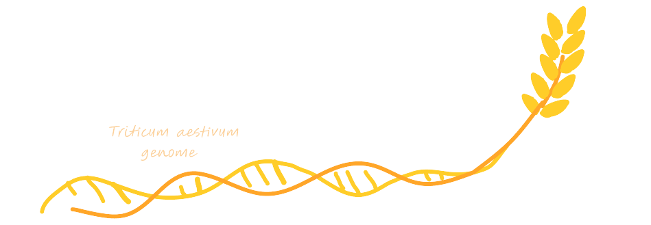

# Structural Genomics Project - M1 GENIOMHE 2024/25: 

## Exploration of the _Triticum aestivum_ sequence

Checking GC content in this region to have an idea about potential gene desnitites. For that we run the script:  

```bash
python src/GC_content.py data/region8.fasta
```
The GC content of the DNA sequence is 48%.


## Transcriptome:  

The [European Nucleotide Archive (ENA)](https://www.ebi.ac.uk/ena/browser/home) comprises a large collection of sequencing data from raw sequences to assembly to functionally annotated ones. While looking for [transcriptome studies for _Triticum aestivum_](https://www.ebi.ac.uk/ena/browser/view/Taxon:4565) we find several projects (Total= 22): 

| Accession     | Description                                                      | Accession     | Description                                                      |
|---------------|------------------------------------------------------------------|---------------|------------------------------------------------------------------|
| GAEF01000000  | Triticum aestivum, TSA project GAEF01000000 data                 | GBKH01000000  | Triticum aestivum, TSA project GBKH01000000 data                 |
| GAJL01000000  | Triticum aestivum, TSA project GAJL01000000 data                 | GBKI01000000  | Triticum aestivum, TSA project GBKI01000000 data                 |
| GBKJ01000000  | Triticum aestivum, TSA project GBKJ01000000 data                 | GBKK01000000  | Triticum aestivum, TSA project GBKK01000000 data                 |
| GBZP01000000  | TSA: Triticum aestivum, transcriptome shotgun assembly.          | GDTJ01000000  | Triticum aestivum, TSA project GDTJ01000000 data                 |
| GEUX01000000  | Triticum aestivum, TSA project GEUX01000000 data                 | GEWU01000000  | Triticum aestivum, TSA project GEWU01000000 data                 |
| GFFI01000000  | TSA: Triticum aestivum, transcriptome shotgun assembly.          | GIJS01000000  | Triticum aestivum, TSA project GIJS01000000 data                 |
| GILY01000000  | Triticum aestivum, TSA project GILY01000000 data                 | GIXT01000000  | TSA: Triticum aestivum cultivar TcLr19 isolate leaf, transcriptome shotgun assembly. |
| GJAR01000000  | TSA: Triticum aestivum cultivar Avocet R, transcriptome shotgun assembly. | GJUY01000000  | TSA: Triticum aestivum, transcriptome shotgun assembly.          |
| HAAB01000000  | Triticum aestivum, TSA project HAAB01000000 data                 | HCEC01000000  | TSA: Triticum aestivum                                           |
| HCED01000000  | TSA: Triticum aestivum                                           | IAAK01000000  | TSA: Triticum aestivum, transcriptome shotgun assembly.          |
| IAAL01000000  | TSA: Triticum aestivum, transcriptome shotgun assembly.          | IAAM01000000  | TSA: Triticum aestivum, transcriptome shotgun assembly.          |

_TSA stands for Transcriptome Shotgun Assembly_

One of them is published by [Xiao et al. (2013) in BMC Genomics](https://bmcgenomics.biomedcentral.com/articles/10.1186/1471-2164-14-197) [REF1]. They have performed short read RNA-seq using Illumina Hi-Seq tech, and deposited the project's raw reads on the SRA database, project [`SRX212270`](https://www.ncbi.nlm.nih.gov/sra/?term=SRX212270). We will use this as trial to explore how we can validate using Whole Transcriptomes before optimizing our choice. 

### Trial 1: blasting against transcriptome 

As a first attempt, due to the high memory requirement (_e.g.,_ one of them is 15GB of reads), we have tried performing BLAST on ncbi's server against this whole transcriptome in [REF1] @xiao2013transcriptome, with default parameters (can perform it [here](https://blast.ncbi.nlm.nih.gov/blast/Blast.cgi?PROGRAM=blastn&BLAST_PROGRAMS=megaBlast&PAGE_TYPE=BlastSearch&BLAST_SPEC=SRA&DB_GROUP=Exp&NUM_ORG=1&EQ_MENU=SRX212270) by just adding the [region8 fasta file](./data/region8.fasta)). The default search gave no significant results, we will try to relax the paramters (BLOSUM45 and lowering penalties, accepting lower thresholds...)


### Trial 2: downloading the WTS data

We will try downloading the reads of [1] to see how to manipulate such a large file. Since it surpasses the threshold to download a file from SRA webserver (which is 5GB), we will download it using [`sra-toolkit`]().  
While running out of time and memory, we will try doing that using Galaxy.

## Trial 3: Analysis

Working on galaxy, first retrieve the SRA accession number from the project, tools > Get data > EBI SRA, copy the accession number and get the fastq in galaxy. After loading them (paired end so 2 fastq) > fastq groomer, to make sure the fastq format fits Galaxy's requirement and make it run. Meanwhile > FastQC to maek sure the quality of the transcriptome is good or whether it's better to take another set of reads.

## Trial 3: visualization

_trying to perform RNA-seq aln and viz using IGV_  


## Resources:

- Whole Genome (all 6n chr) of _triticum aestivum_ on ENSEMBL : [https://ftp.ensemblgenomes.ebi.ac.uk/pub/plants/release-60/gff3/triticum_aestivum/](https://ftp.ensemblgenomes.ebi.ac.uk/pub/plants/release-60/gff3/triticum_aestivum/  )  
- ENSEMBL  in general : [https://plants.ensembl.org/Triticum_aestivum/Info/Index](https://plants.ensembl.org/Triticum_aestivum/Info/Index)  
- ENA: [https://www.ebi.ac.uk/ena/browser/view/Taxon:4565](https://www.ebi.ac.uk/ena/browser/view/Taxon:4565) 
- SRA: Sequence Read Archive, repository for seq data   
- RNAseq reads fetch and viz: [youtube video](https://www.youtube.com/watch?v=Wfxh9_fsRfo&t=330s)


## References

[1] Xiao, J., Jin, X., Jia, X., Wang, H., Cao, A., Zhao, W., ... & Wang, X. (2013). Transcriptome-based discovery of pathways and genes related to resistance against Fusarium head blight in wheat landrace Wangshuibai. BMC genomics, 14, 1-19.

