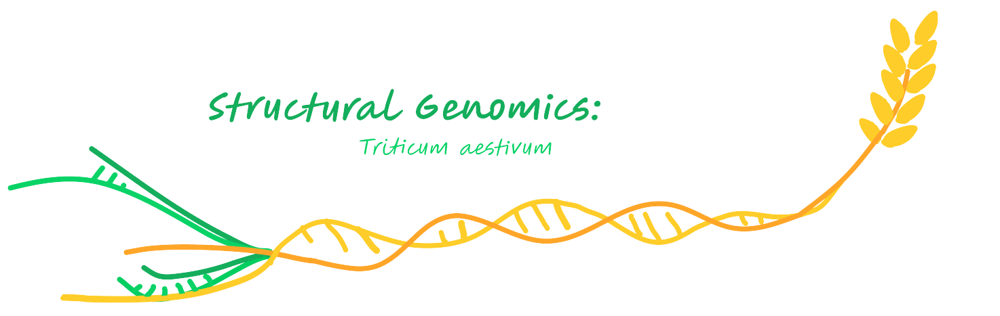
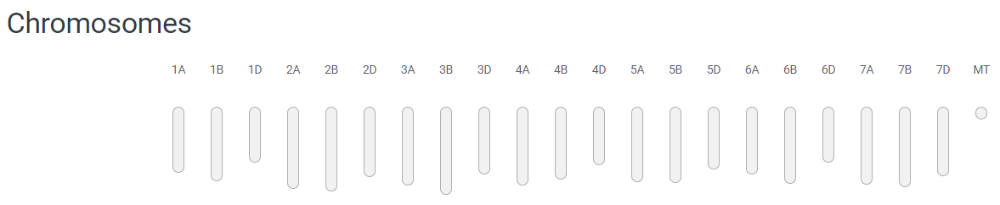
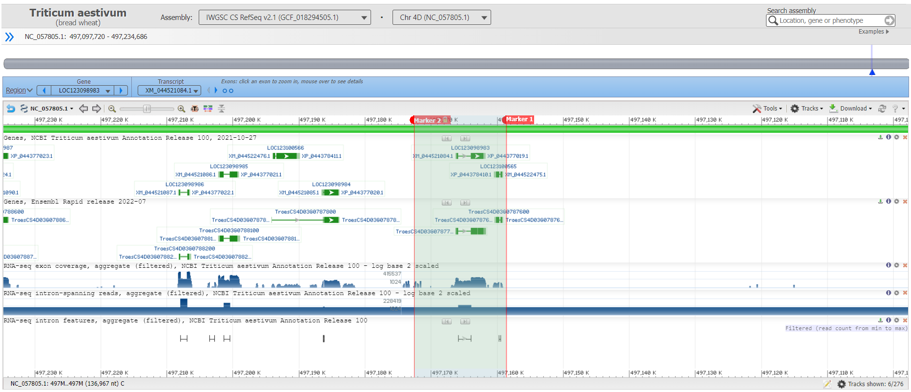
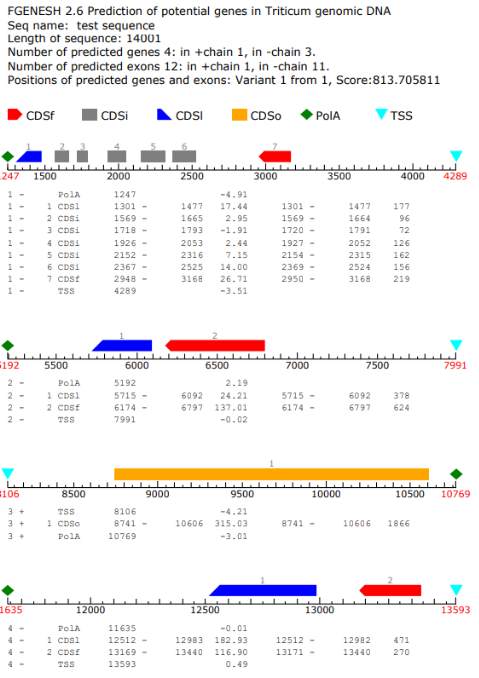
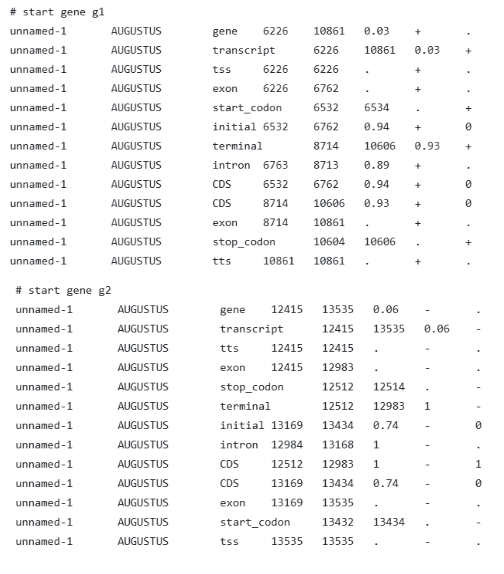
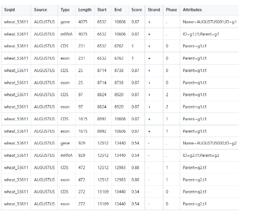
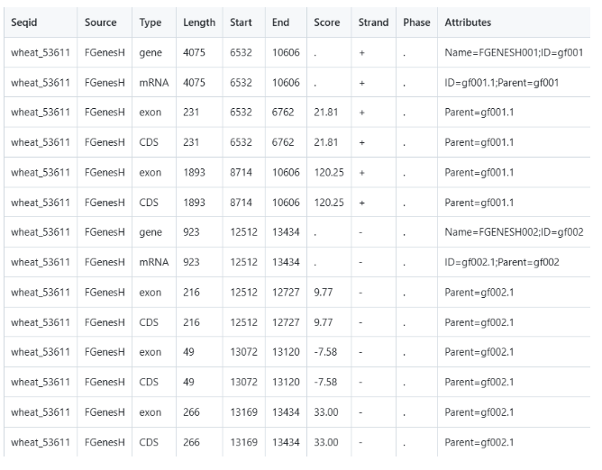
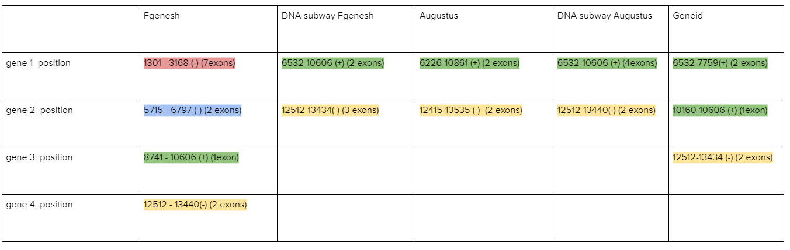
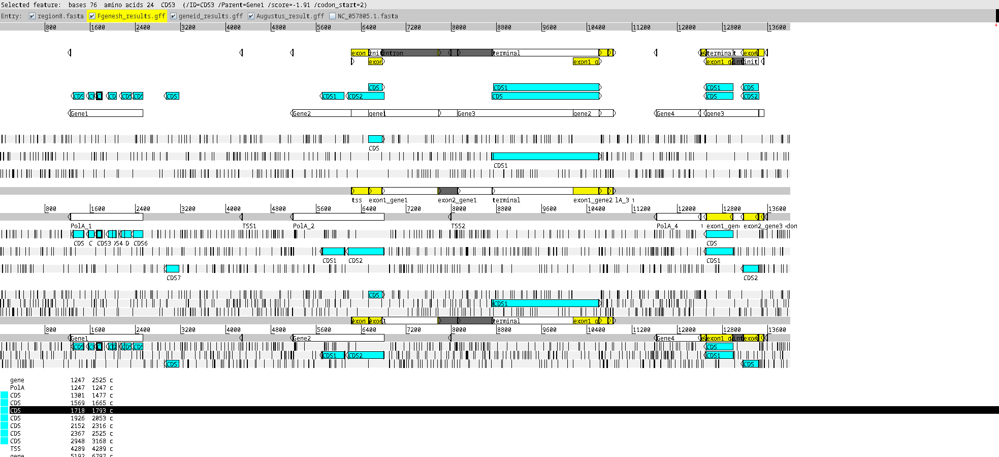
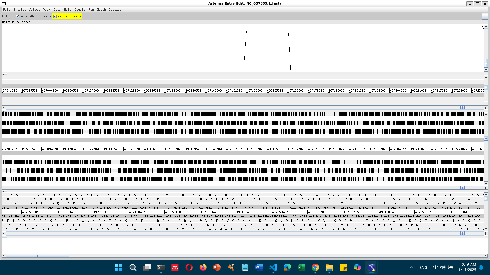

<!-- # Project - M1 GENIOMHE 2024/25:  -->

<!--  -->

# Table of contents

- [Introduction](#introduction)
- [Exploration](#exploration)
  - [Sequence properties](#sequence-properties)
  - [Region localization](#region-localization)
- [Gene Prediction](#gene-prediction)
    - [Tools](#tools)
        - [FGENESH](#fgenesh)
        - [GENEID](#geneid)
        - [AUGUSTUS](#augustus)
    - [Visualization](#visualization)
- [Gene Validation](#gene-validation)
    - [BLAST](#blast)
        - [Tritium aestivum proteome](#tritium-aestivum-proteome)
        - [Related species](#related-species)
            - [Triticum durum](#triticum-durum)
            - [Aegilops tauschii](#aegilops-tauschii)
    - [Transcriptome](#transcriptome)
        - [Trial 1: blasting against transcriptome](#trial-1-blasting-against-transcriptome)
        - [Trial 2: downloading the WTS data](#trial-2-downloading-the-wts-data)
        - [Trial 3: Analysis](#trial-3-analysis)
        - [Trial 4: visualization](#trial-4-visualization)
    - [cDNA](#cdna)
- [Transposable Elements (TEs)](#transposable-elements-tes)
- [Final annotation](#final-annotation)
- [Supplementary](#supplementary)

_this project can be found on github at [github.com/raysas/wheat-seq-annotation](https://github.com/raysas/wheat-seq-annotation) where all files including code, data, figures, results and documentation can be found for your reference_

## Introduction

_Introduction on the species, structural genomics and goal of this project, then discuss potential issues that might arise due to complexity. Proceed by summarizing the desired workflow highlighting the criteria demanded by the instructor to be fulfilled_

_Triticum aevistum_ is a complex eukaryotic organism belonging to kingdom Plantae, phylum Angiosperms, class Monocots, order Poales, family Poaceae, genus Triticum. It is a hexaploid species with a large genome, consisting of 7n chromosomes. The genome is highly complex due to its polyploid nature, with three subgenomes (A, B, and D) derived from three ancestral species. The A and B chromosomes are derived from _Triticum monococcum_ and _Triticum durum_, while the D chromosome is derived from _Aegilops tauschii_. The genome is characterized by a high gene density, with a large number of protein-coding genes, non-coding RNAs, and transposable elements (TEs). 




# Exploration

## Sequence properties

Checking GC content in this region to have an idea about potential gene desnitites. For that we run the script:  

```bash
$ python src/GCcontent.py data/region8.fasta
0.48
```
The GC content of the DNA sequence is 48%.

We proceed to see the length of the sequence:  
```bash
$ expr $(tail -n +2 data/region8.fasta | wc -c) - $(tail -n +2 data/region8.fasta | wc -l)
14001
```
region8 is 14,001 bases long.

## Region localization

Want to localize this region by mapping agaisnt the reference sequence of _Triticum aestivum_ (available on RefSeq at [GCF_018294505.1](https://www.ncbi.nlm.nih.gov/datasets/genome/GCF_018294505.1/)), which consists of $7n$ chromosomes[^8]. After retrieving the reference sequence, we perfomed mapping through Burrows-Wheeler Aligner MEM (bwa-mem) algorithm, and due to large genome size, we did this step on Galaxy because of the large computation time and memory required. 
```bash
$ bwa-mem2 mem -t 4 data/sequences/reference/GCF_018294505.1_genomic.fna \ 
    data/region8.fasta > data/sequences/alignment/region8.sam
$ samtools sort data/sequences/alignment/region8.sam \ 
    > data/sequences/alignment/region8_aln.bam 
$ bedtools bamtobed -i data/sequences/alignment/region8_aln.bam \  
    > data/sequences/alignment/region8_aln.bed
```
_We chose this mapper because it's perfect for medium length reads ranging between 100bp and megabases, in our case it's a 14kb sequence_

Now we have in the output a `.bam` file and a `.bed` file. From the `.bam` file we can get the following information when running the following command:  
```bash
$ samtools view -c -F 4 data/sequences/alignment/region8_aln.bam
```
```text
region8 16      NC_057805.1     497158671       60      9565M1I4435M    *       0       0       
<sequence>   *  NM:i:5   MD:Z:9565A1651C131G821T1828     AS:i:13973      XS:i:2788
```

From the `.bam` output we can see[^6]: 

* The CIGAR string `9565M1I4435M`, means that the read is 9565 bases long, then there is an insertion of 1 base, and then 4435 more bases.  
* The `NM:i:5` field indicates that there are 5 mismatches in the alignment.  
* The `MD:Z:9565A1651C131G821T1828` field indicates the mismatches in the alignment. 

If we further proceed conversion onto a `.bed` file, we get the following info:  
```text
NC_057805.1	497158670	497172670	region8	60	-
```
This means that the region8 is:  

* located on the chromosome `NC_057805.1`  
* position starting from `497158670` and ending at `497172670`  
* on the negative strand.

___Reflection___: our sequence is of length 14469, and the read is 9565+1+4435=14001, which means that the alignment is EXACTLY the same length as the sequence, and the 5 mismatches are not significant relative to the number of bases. We can thus infer that region8 is well mapped to the reference genome on the negative strand of chromosome `NC_057805.1` starting at position `497158670` and ending at `497172670`. And according to the table in [^8] retrieved from RefSeq, this chromosome is the 4D chromosome of _Triticum aestivum_.



We can visualize the `.bed` file in [Ensembl Plants, IWGSC assembly converter](https://plants.ensembl.org/Triticum_aestivum/Tools/AssemblyConverter)

Moreover, this region has a GC content of 48% (as reported earlier), which is ~2% higher than the average GC content of the whole 4D chromosome (46.5%). This might indicate a high gene density in this region, as genes are known to have a higher GC content than the rest of the genome.

# Gene Prediction

## Tools

### FGENESH



We used the FGENESH site, providing only the name of the organism, Triticum aestivum (wheat), and the DNA sequence. The default settings used a gene prediction model specifically trained for Triticum aestivum, which allowed the software to identify potential genes, exons, and other features such as transcription start sites (TSS) and polyadenylation sites (PolA). The output includes the positions of coding sequences : The parts of exons encoding proteins, TSS (Transcription Start Site): Where transcription begins, PolA (Polyadenylation Site): Where mRNA processing ends.
The FGENESH analysis of a 14,001 bp Triticum genomic DNA sequence predicted four genes, with one on the positive strand and three on the negative strand. In total, 12 exons were identified, with one on the positive strand and 11 on the negative strand.
Gene 1, located on the negative strand, extends from position 1301 to 3168 and contains 7 exons, starting with the first coding exon (CDSl) at 1301–1477 and ending with the last exon (CDSf) at 2948–3168. It also includes 5 intermediate coding exons at positions 1569–1665, 1718–1783, 1926–2053, 2152–2316, and 2367–2525.  The transcription start site (TSS) is identified at position 4289, while the polyadenylation site (PolA) is located at 1247. This gene translates into a protein of 340 amino acids.
Gene 2, also on the negative strand, extends from 5715 to 6797 and contains 2 exons, with the first coding exon (CDSl) at 5715–6092 and the last exon (CDSf) at 6174–6797, producing a protein of 333 amino acids. The Transcription start site (TSS) is identified at position 7991, while polyadenylation site (PolA) is located at 5192.
Gene 3, on the positive strand, is a single-exon gene (CDSo) located between 8741 and 10606, encoding a protein of 621 amino acids. The Transcription start site (TSS) is identified at position 8106, while polyadenylation site (PolA) is located at 10769.
Gene 4, on the negative strand, spans 12512–13440 with 2 exons; the first coding exon (CDSl) is at 12512–12983, and the final exon (CDSf) is at 13169–13440, translating into a protein of 247 amino acids. Transcription start site (TSS) is identified at position 13593, while polyadenylation site (PolA) is located  at 11635.
The gene features, including exon positions and their strand orientation, suggest diverse transcriptional structures, with detailed sequences provided for both mRNA and proteins.


### GENEID

Gene 1 is located on the forward strand (+) and consists of two exons, with the first exon positioned from 6532 to 6762 and the terminal exon from 7754 to 7759. Gene 2 is also on the forward strand (+) and is a single-exon gene, extending from 10160 to 10606. 
In contrast, Gene 3 is on the reverse strand (-) and has two exons, with the terminal exon located between 12512 and 12983, and the first exon from 13169 to 13434. The annotation reflects the strand orientation, with Gene 1 and Gene 2 being forward-strand genes, while Gene 3 is on the reverse strand, where exons are annotated in reverse order, starting from the terminal exon


### AUGUSTUS



The AUGUSTUS gene prediction tool (version 3.3.3) analyzed a 14,001 bp sequence using the wheat parameter set and identified two genes, one on the forward strand and one on the reverse strand. Gene 1 on the forward strand, extends  from 6226 to 10861 and contains two exons separated by an intron. The start codon is located in exon 1 (6532–6534), while the stop codon is in exon 2 (10604–10606). The coding sequence (CDS) includes two segments: 6532–6762 and 8714–10606. Gene 2, on the reverse strand, spans positions 12415–13535 and also contains two exons with an intron between them. The stop codon is in exon 1 (12512–12514), and the start codon is in exon 2 (13432–13434). The CDS includes two regions: 12512–12983 and 13169–13434. Both genes encode functional proteins. This detailed output highlights exon-intron boundaries, coding regions, and predicted protein sequences, which are valuable for downstream analyses like functional annotation and experimental validation.



The AUGUSTUS tool identified two genes, g1 and g2, in the wheat sequence wheat_53611. Gene 1, located on the forward strand, spans positions 6532–10606 with a length of 4075 bp and a high prediction score of 0.87. It consists of four exons, with CDS regions ranging from 6532–6762, 8714–8738, 8824–8920, and 8992–10606. Gene 2, located on the reverse strand, spans positions 12512–13440 with a length of 929 bp and a prediction score of 0.54. It contains two exons, with CDS regions spanning 12512–12983 and 13169–13440. These predictions highlight the structural details of both genes, including exon-intron boundaries and coding sequences, which are critical for downstream analyses such as functional annotation and protein prediction.



The FGENESH tool identified two genes, gf001 and gf002, in the wheat sequence wheat_53611. Gene gf001, located on the forward strand, spans positions 6532–10606 with a length of 4075 bp. It consists of two exons, the first spanning 6532–6762 (231 bp, score 21.81) and the second spanning 8714–10606 (1893 bp, score 120.25). Both exons contribute to the coding sequence (CDS). Gene gf002, located on the reverse strand, spans positions 12512–13434 with a length of 923 bp. It contains three exons: the first spans 12512–12727 (216 bp, score 9.77), the second spans 13072–13120 (49 bp, score -7.58), and the third spans 13169–13434 (266 bp, score 33.00). These detailed annotations provide insights into gene structures, exon positions, and strand orientation, making them valuable for downstream analysis and functional studies.

| Gene Position | Fgenesh (exons)         | DNA Subway Fgenesh (exons) | Augustus (exons)           | DNA Subway Augustus (exons) | Geneid (exons)            |
|---------------|-------------------------|----------------------------|----------------------------|-----------------------------|---------------------------|
| **Gene 1**    | 1301–3168 (-) (7 exons) | 6532–10606 (+) (2 exons)   | 6226–10861 (+) (2 exons)   | 6532–10606 (+) (4 exons)    | 6532–7759 (+) (2 exons); 10160–10606 (+) (1 exon)   |
| **Gene 2**    | 5715–6797 (-) (2 exons) | 12512–13434 (-) (3 exons)  | 12415–13535 (-) (2 exons)  | 12512–13440 (-) (2 exons)   | -  |
| **Gene 3**    | 8741–10606 (+) (1 exon) | -                          | -                          | -                           | -                         |
| **Gene 4**    | 12512–13440 (-) (2 exons) | -                          | -                          | -                           | 12512–13434 (-) (2 exons) |



**Common regions**:

- **Gene 1** (green region) : The gene spanning from 6532 to 10606 on the forward strand (+), marked in green in the results of the DNA subway Fgenesh, is a consistent feature across multiple gene prediction tools but with some variations. Augustus and DNA subway augustus predict this gene at a slightly extended position from 6226 to 10861 with 2 exons for augustus and from 6532 to 10606 with 4 exons for DNA subway augustus.
Geneid also identifies this region but divides it into two separate predictions: one from 6532 to 7759 (2 exons) and another one from 10160 to 10606 (1exon). This split in Geneid’s prediction suggests  a possible alternative structure or fragmentation. FGENESH, while differing in interpretation, may be representing the same gene with variation, as it predicts a single-exon gene extending from 8741 to 10606 (the green region) on the forward strand, aligning with the green region predicted in the other tools.  
For the other region predicted by FGENESH that extends from 5715 to 6797 ( the blue region ) on the reverse strand (-) with 2 exons, it is not supported by the other tools. This region may partially overlap with predictions made by tools that focus on nearby regions but it does not appear explicitly as a standalone gene in the results of tools like AUGUSTUS or GENEID or DNA subway Fgenesh.
- **Gene 2** (yellow region) : the gene extending from 12512 to 13434 on the reverse strand (-) with 3 exons, marked in yellow in the results of the DNA subway Fgenesh, is a consistent feature across multiple gene prediction tools but with slight differences in exon count and exact positions. FGENESH predicts this region as a gene with 2 exons, extending from 12512 to 13440, aligning with the prediction of DNA subway Fgenesh. Augustus predicts this region as a gene spanning from 12415 to 13535 with 2 exons, slightly extending the boundaries compared to FGENESH. GENEID matches closely with FGENESH, predicting this gene at 12515 to 13434 with 2 exons.
This consistency in identifying this region across tools indicates that it is a reliable gene prediction, with the variations in exon count and precise start-end positions reflecting the differences in each tool’s algorithm.
	
**Non common regions**:

The region highlighted in _pink_ (1301-3168 on the reverse strand) is a unique prediction made exclusively by FGENESH. According to FGENESh, this region has 7 exons starting from 1301 and ending at 3168. This prediction is not supported by any of the other tools used in the analysis, such as DNA Subway FGENESH, AUGUSTUS or Geneid which do not identify a gene in this specific region.
The lack of agreement from other tools suggests that this region might be an artifact of the FGENESH algorithm, a false positive, or a region with characteristics that make it detectable only by FGENESH. Alternatively, it could represent a low-confidence or poorly conserved gene that is difficult for other tools to detect

$\iff$ These variations between the tools highlight the need for further investigation, validation as through transcriptomic data, to confirm the existence, structure, and functionality of these predicted genes and to ensure biologically meaningful results.


## Visualization

In order to visualize the features predicted by the abovementioned tools on artemis we first need to convert them to `.gff` format.





# Gene Validation

## BLAST

We will perform a BLAST search of the predicted genes against related species proteomes locally, using blast+ package on unix terminal. 

> Blasting done through `blastp` program on the predicted genes from region8 (each tool generated .faa fasta file that is amino acid sequences, each sequence will be a query).  

The proteomes were retrieved from UniProt as it is recommended to be the way to download proteome for a whole species by an EMBL-EBI training course on UniProt[^7], we will provide an api to retrieve the sequences as well to make our work replicable.  

Since we're blasting against local databases built from proteomes retrieved from UniProt, the resulting hits have UniProt IDs, instead of product or gene names, thus an extra processing step was taken to annotate the results through a python script using `biopython`'s `ExPASy` and `SwissProt` modules.

> On another note, the advantages of blasting locally here on particular species is it's more specific and centered towards the species of interest, and provides a larger set of similar proteins in comparison to swissport for instance, which has a very limited number of reviewed proteins in each of the species we are interested in, which will be noted in the results.

### Tritium aestivum proteome

To validate the predicted genes, we will start of by blasting against the proteome of _Triticum aestivum_ available on UniProt. We retrieved the list of proteins from the supplementary material of an International Wheat Genome Sequencing Consortium (IWGSC) published in _Science_[^5] aiming to provide an annotated reference sequence of the _Triticum aestivum_ genome. The article is available [here](https://europepmc.org/article/MED/30115783). We will access all the proteins sequences (including isoforms) using an api call to the UniProt database.

```bash
$ curl https://rest.uniprot.org/uniprotkb/stream?compressed=true&format=fasta&query=%28%28lit_pubmed%3A30115783%29%29 \
    > data/sequences/proteome/Triticum_aestivum_proteins.fasta.gz
$ gunzip data/sequences/proteome/Triticum_aestivum_proteins.fasta.gz
$ cat data/sequences/proteome/Triticum_aestivum_proteins.fasta | grep '>' | wc -l 
130283
```
There is a total of 130,283 proteins in the file. We will now perform a BLAST search against this database to see if our predicted genes are similar to any of the known annotated proteins of _Triticum aestivum_. It'll be a blastp search, as we are looking for protein sequences that are similar to our predicted sequence (which is already translated by our tools output and saved in out repository in .faa files)

We provided the commands to make blast databases and perform the search in the `blast.sh` script.
```bash
./src/blast.sh
```


### Related species

Starting from the following information:  
* _Triticum monococcum_ and _Triticum durum_ have the A and B chromosomes  
* _Aegilops tauschii_ has the D chromosome

We will also look for their proteomes and perform the same blasting procedure as above.  

**N.B**: we couldn't find _Tri. monococcum_ proteome on UniProt, so we will only blast against _Tri. durum_ for the common A and B chromosomes.

#### Triticum durum

The proteome can be find on [this UniProt page](https://www.uniprot.org/uniprotkb?query=%28taxonomy_id%3A4567%29), 188,826 proteins, worth noting that only 2 of them are expertly reviewed - Swiss-Prot - the rest are unreviewed - TrEMBL.

For _Triticum durum_, retrieving the proteome through this api call:
```bash
$ curl https://rest.uniprot.org/uniprotkb/stream?compressed=true&format=fasta&query=%28%28taxonomy_id%3A4567%29%29 \
    > data/sequences/proteome/Triticum_durum_proteins.fasta.gz  
$ gunzip data/sequences/proteome/Triticum_durum_proteins.fasta.gz
```

#### Aegilops tauschii

The proteome can be find on [_this UniProt page_](https://www.uniprot.org/uniprotkb?query=%28taxonomy_id%3A200361%29),  214,193 proteins, only one of them is expertly reviewed.

Retrieving the proteome through this api call:
```bash
$ curl https://rest.uniprot.org/uniprotkb/stream?compressed=true&format=fasta&query=%28%28taxonomy_id%3A200361%29%29 \
    > data/sequences/proteome/Aegilops_tauschii_proteins.fasta.gz
$ gunzip data/sequences/proteome/Aegilops_tauschii_proteins.fasta.gz
```

## Transcriptome 

_still testing, might remove later_

The [_European Nucleotide Archive (ENA)_](https://www.ebi.ac.uk/ena/browser/home) comprises a large collection of sequencing data from raw sequences to assembly to functionally annotated ones. While looking for [transcriptome studies for _Triticum aestivum_](https://www.ebi.ac.uk/ena/browser/view/Taxon:4565) we find several projects (Total= 22, in this table[^1]) 

_TSA stands for Transcriptome Shotgun Assembly_

One of them is published by [Xiao et al. (2013) in BMC Genomics](https://bmcgenomics.biomedcentral.com/articles/10.1186/1471-2164-14-197) [^4]. They have performed short read RNA-seq using Illumina Hi-Seq tech, and deposited the project's raw reads on the SRA database, project [`SRX212270`](https://www.ncbi.nlm.nih.gov/sra/?term=SRX212270). We will use this as trial to explore how we can validate using Whole Transcriptomes before optimizing our choice. 

### Trial 1: blasting against transcriptome 

As a first attempt, due to the high memory requirement (_e.g.,_ one of them is 15GB of reads), we have tried performing BLAST on ncbi's server against this whole transcriptome in [^2], with default parameters (can perform it [here](https://blast.ncbi.nlm.nih.gov/blast/Blast.cgi?PROGRAM=blastn&BLAST_PROGRAMS=megaBlast&PAGE_TYPE=BlastSearch&BLAST_SPEC=SRA&DB_GROUP=Exp&NUM_ORG=1&EQ_MENU=SRX212270) by just adding the [region8 fasta file](./data/region8.fasta)). The default search gave no significant results, we will try to relax the paramters (BLOSUM45 and lowering penalties, accepting lower thresholds...)


### Trial 2: downloading the WTS data

We will try downloading the reads of [^2] to see how to manipulate such a large file. Since it surpasses the threshold to download a file from SRA webserver (which is 5GB), we will download it using [`sra-toolkit`]().  
While running out of time and memory, we will try doing that using Galaxy[^3][^4].

### Trial 3: Analysis

Working on galaxy, first retrieve the SRA accession number from the project, tools > Get data > EBI SRA, copy the accession number and get the fastq in galaxy. After loading them (paired end so 2 fastq) > fastq groomer, to make sure the fastq format fits Galaxy's requirement and make it run. Meanwhile > FastQC to make sure the quality of the transcriptome is good or whether it's better to take another set of reads.

We will try now mapping: using Tophat2, we will map the reads to the reference genome of _Triticum aestivum_ (available on ENSEMBL) to see how many reads are mapped and how many are not. We have taken the reference genome using 

### Trial 4: visualization

_trying to perform RNA-seq aln and viz using IGV_  

### cDNA

cDNA (complementary DNA) is a single-stranded DNA synthesized from a messenger RNA (mRNA) template in a reaction catalyzed by the enzyme reverse transcriptase. It is thus synthesized from the mRNA template, it can be used to study the gene expression in a cell, as it is a copy of the mRNA, and can be used to study the gene expression in a cell. It's a representation of a gene's transcript.  
On Ensembl Plants, we can find the cDNA of _Triticum aestivum_ [_here on this ftp site (click link)_](https://plants.ensembl.org/Triticum_aestivum/Info/Index). There is one fasta file containing all of the genome's cDNA sequences, with a particular header format. To make the process more easily computable, we wrote  a bash script to filter the cDNA sequences of the chromosome 4D, and save them in a separate file.  

_also downloaded pep, CDS, ncRNA and annotations (gff)_


# Transposable Elements (TEs) 

# Final annotation

Gene 1 of Augustus (predicted protein) which has a length of 707aa has shown to perfectly align with a subject of the protein [..] which also has the same length, so this is our first final annotated gene, with positions as reported by AUGUSTUS:

| Feature        | Start   | End     |
|----------------|---------|---------|
| gene           | 6226    | 10861   |
| transcript     | 6226    | 10861   |
| tss            | 6226    | 6226    |
| exon           | 6226    | 6762    |
| start_codon    | 6532    | 6534    |
| initial        | 6532    | 6762    |
| terminal       | 8714    | 10606   |
| intron         | 6763    | 8713    |
| CDS            | 6532    | 6762    |
| CDS            | 8714    | 10606   |
| exon           | 8714    | 10861   |
| stop_codon     | 10604   | 10606   |
| tts            | 10861   | 10861   |

[structure and protein from uniprot]


# Supplementary


- Whole Genome (all 7n chr) of _triticum aestivum_ on ENSEMBL : [https://ftp.ensemblgenomes.ebi.ac.uk/pub/plants/release-60/gff3/triticum_aestivum/](https://ftp.ensemblgenomes.ebi.ac.uk/pub/plants/release-60/gff3/triticum_aestivum/  )  
- ENSEMBL  in general : [https://plants.ensembl.org/Triticum_aestivum/Info/Index](https://plants.ensembl.org/Triticum_aestivum/Info/Index)  
- ENA: [https://www.ebi.ac.uk/ena/browser/view/Taxon:4565](https://www.ebi.ac.uk/ena/browser/view/Taxon:4565) 
- SRA: Sequence Read Archive, repository for seq data   
- RNAseq reads fetch and viz: [youtube video](https://www.youtube.com/watch?v=Wfxh9_fsRfo&t=330s)   
- RefSeq: reference sequence v2.1 [here](https://www.ncbi.nlm.nih.gov/datasets/genome/GCF_018294505.1/), link to acces the dataset is [_here_](https://api.ncbi.nlm.nih.gov/datasets/v2/genome/accession/GCF_018294505.1/download?include_annotation_type=GENOME_FASTA&include_annotation_type=GENOME_GFF&include_annotation_type=RNA_FASTA&include_annotation_type=CDS_FASTA&include_annotation_type=PROT_FASTA&include_annotation_type=SEQUENCE_REPORT&hydrated=FULLY_HYDRATED)  
- [downloading a proteome of a species from uniprot](https://www.ebi.ac.uk/training/online/courses/uniprot-exploring-protein-sequence-and-functional-info/when-to-use-uniprot-guided-example-clone/downloading-a-proteome-set-for-specific-organism/#:~:text=Go%20to%20the%20UniProt%20website,61%20Dataset%20selection%20drop%2Ddown.), EMBL-EBI training course  
- Chromosome 4D annotations in GFF [_ftp link_](https://ftp.ensemblgenomes.ebi.ac.uk/pub/plants/release-60/gff3/triticum_aestivum/Triticum_aestivum.IWGSC.60.chromosome.4D.gff3.gz)

<!-- ### Acknowledgements -->

[^1]:       | Accession     | Description                                                      |
    |---------------|------------------------------------------------------------------|
    | GAEF01000000  | Triticum aestivum, TSA project GAEF01000000 data                 |
    | GAJL01000000  | Triticum aestivum, TSA project GAJL01000000 data                 |
    | GBKH01000000  | Triticum aestivum, TSA project GBKH01000000 data                 |
    | GBKI01000000  | Triticum aestivum, TSA project GBKI01000000 data                 |
    | GBKJ01000000  | Triticum aestivum, TSA project GBKJ01000000 data                 |
    | GBKK01000000  | Triticum aestivum, TSA project GBKK01000000 data                 |
    | GBZP01000000  | TSA: Triticum aestivum, transcriptome shotgun assembly.          |
    | GDTJ01000000  | Triticum aestivum, TSA project GDTJ01000000 data                 |
    | GEUX01000000  | Triticum aestivum, TSA project GEUX01000000 data                 |
    | GEWU01000000  | Triticum aestivum, TSA project GEWU01000000 data                 |
    | GFFI01000000  | TSA: Triticum aestivum, transcriptome shotgun assembly.          |
    | GIJS01000000  | Triticum aestivum, TSA project GIJS01000000 data                 |
    | GILY01000000  | Triticum aestivum, TSA project GILY01000000 data                 |
    | GIXT01000000  | TSA: Triticum aestivum cultivar TcLr19 isolate leaf, transcriptome shotgun assembly. |
    | GJAR01000000  | TSA: Triticum aestivum cultivar Avocet R, transcriptome shotgun assembly. |
    | GJUY01000000  | TSA: Triticum aestivum, transcriptome shotgun assembly.          |
    | HAAB01000000  | Triticum aestivum, TSA project HAAB01000000 data                 |
    | HCEC01000000  | TSA: Triticum aestivum                                           |
    | HCED01000000  | TSA: Triticum aestivum                                           |
    | IAAK01000000  | TSA: Triticum aestivum, transcriptome shotgun assembly.          |
    | IAAL01000000  | TSA: Triticum aestivum, transcriptome shotgun assembly.          |
    | IAAM01000000  | TSA: Triticum aestivum, transcriptome shotgun assembly.          |


[^2]: Xiao, J., Jin, X., Jia, X., Wang, H., Cao, A., Zhao, W., ... & Wang, X. (2013). Transcriptome-based discovery of pathways and genes related to resistance against Fusarium head blight in wheat landrace Wangshuibai. BMC genomics, 14, 1-19.

[^3]:The Galaxy platform for accessible, reproducible, and collaborative data analyses: 2024 update
Nucleic Acids Research, gkae410
doi:10.1093/nar/gkae410

[^4]:The Galaxy server used for some calculations is partly funded by the German Federal Ministry of Education and Research BMBF grant 031 A538A de.NBI-RBC and the Ministry of Science, Research and the Arts Baden-Württemberg (MWK) within the framework of LIBIS/de.NBI Freiburg.

[^5]:The International Wheat Genome Sequencing Consortium (IWGSC) et al. ,Shifting the limits in wheat research and breeding using a fully annotated reference genome.Science361,eaar7191(2018).DOI:10.1126/science.aar7191

[^7]:EMBL-EBI training course on UniProt: [https://www.ebi.ac.uk/training/online/courses/uniprot-exploring-protein-sequence-and-functional-info/](https://www.ebi.ac.uk/training/online/courses/uniprot-exploring-protein-sequence-and-functional-info/when-to-use-uniprot-guided-example-clone/downloading-a-proteome-set-for-specific-organism/#:~:text=Go%20to%20the%20UniProt%20website,61%20Dataset%20selection%20drop%2Ddown.)

[^6]: Li, Heng, et al. "The sequence alignment/map format and SAMtools." bioinformatics 25.16 (2009): 2078-2079. 

[^8]:   | Chromosome | GenBank      | RefSeq        | Size (bp)   | GC content (%) | Unlocalized count | Action |
    |------------|--------------|---------------|-------------|-----------------|-------------------|--------|
    | 1A         | CM031178.1   | NC_057794.1   | 598,660,471 | 46              | 0                 |        |
    | 1B         | CM031179.1   | NC_057795.1   | 700,547,350 | 46              | 0                 |        |
    | 1D         | CM031180.1   | NC_057796.1   | 498,638,509 | 46.5            | 0                 |        |
    | 2A         | CM031181.1   | NC_057797.1   | 787,782,082 | 46              | 0                 |        |
    | 2B         | CM031182.1   | NC_057798.1   | 812,755,788 | 46              | 0                 |        |
    | 2D         | CM031183.1   | NC_057799.1   | 656,544,405 | 46.5            | 0                 |        |
    | 3A         | CM031184.1   | NC_057800.1   | 754,128,162 | 46              | 0                 |        |
    | 3B         | CM031185.1   | NC_057801.1   | 851,934,019 | 46              | 0                 |        |
    | 3D         | CM031186.1   | NC_057802.1   | 619,618,552 | 46.5            | 0                 |        |
    | 4A         | CM031187.1   | NC_057803.1   | 754,227,511 | 46              | 0                 |        |
    | 4B         | CM031188.1   | NC_057804.1   | 673,810,255 | 46.5            | 0                 |        |
    | 4D         | CM031189.1   | NC_057805.1   | 518,332,611 | 46.5            | 0                 |        |
    | 5A         | CM031190.1   | NC_057806.1   | 713,360,525 | 46              | 0                 |        |
    | 5B         | CM031191.1   | NC_057807.1   | 714,697,677 | 46              | 0                 |        |
    | 5D         | CM031192.1   | NC_057808.1   | 569,951,140 | 46.5            | 0                 |        |
    | 6A         | CM031193.1   | NC_057809.1   | 622,669,697 | 46              | 0                 |        |
    | 6B         | CM031194.1   | NC_057810.1   | 731,188,232 | 46.5            | 0                 |        |
    | 6D         | CM031195.1   | NC_057811.1   | 495,380,293 | 46.5            | 0                 |        |
    | 7A         | CM031196.1   | NC_057812.1   | 744,491,536 | 46              | 0                 |        |
    | 7B         | CM031197.1   | NC_057813.1   | 764,072,961 | 46              | 0                 |        |
    | 7D         | CM031198.1   | NC_057814.1   | 642,921,167 | 46.5            | 0                 |        |
    | MT         | EU534409.1   | NC_036024.1   | 452,526     | 44.5            | 0                 |        |
