<!-- ---
title: "M1 GENIOMHE 2024/25: Project"
subtitle: "Structural Genomics of _Triticum aestivum_"
author: "Group members: Aya BEN TAGHALINE, Joelle ASSY, Rayane ADAM"
--- -->

# Structure Genomics Project 2024/25


## Table of contents

- [Introduction](#introduction)
- [Exploration](#exploration)
  - [Sequence properties](#sequence-properties)
  - [Region localization](#region-localization)
- [Gene Prediction](#gene-prediction)
- [Gene Validation](#gene-validation)
  - [BLAST](#blast)
  - [Transciptome](#transciptome)
- [Transposable Elements](#transposable-elements)
- [Final Annotation](#final-annotation)
- [Conclusion](#conclusion)


## Introduction


_Triticum aevistum_ (commonly known as wheat), is a complex eukaryotic organism belonging to kingdom Plantae, phylum Angiosperms, class Monocots, order Poales, family Poaceae, genus Triticum. This plant has been considered as one of the most important crops in the world, providing a staple food source for billions of people as it is mainly used to make bread.   

Even though it is somehow considered a model organism in plant biology, it has a complex genome structure that makes it difficult to study. It is a hexaploid species with a large genome, consisting of 7n chromosomes and a high rate of repeats and transposable elements. This polyploidy is in fact derived from the hybridization of three different species due to an evolutionary event that occurred around 8,500–9,000 years ago. It comes from a tetraploid species having BBAA chromosomes and a diploid species having DD chromosomes. The tetraploid species is believed to be a free-threshing species and can be thought to be _Triticum monococcum_ or _Triticum durum_, whereas the diploid species is _Aegilops tauschii_. Ending up with a hexaploid species with BBAADD chromosomes.[^10]

[^10]: Levy, Avraham A., and Moshe Feldman. "Evolution and origin of bread wheat." The Plant Cell 34.7 (2022): 2549-2567.


The goal of this project is to annotate a specific region of the genome of _Triticum aestivum_ (wheat), mainly structurally annotate, using bioinformatics tools. The region of interest is a 14,001 bp sequence (`region8`), which we will analyze to predict genes, transposable elements, and other features. This task is considerably a hard one taking into consideration this complicated genome structure from polyploidy and the richness of repetitive elements, as well as its large size.  
In this project, we will start of by a minor exploration fo our region then we'll perform gene prediction using a variety of tools then analyze and validate these results. We will also look for transposable elements in the region and perform a final annotation of the region to conclude with this report. We have used online servers, databases, api calls, unix tools, visualization software, python & bash scripting to perform the analysis. Supplementary results, data, code, figures and documentation can be found on the github repository of this project: [github.com/raysas/wheat-seq-annotation](https://github.com/raysas/wheat-seq-annotation).

_Tools, databases and utils used in this project are listed in the following table by alphabetical order:_


| Name                     | Type                | Use                                                                                     |
|--------------------------|---------------------|-----------------------------------------------------------------------------------------|
| AUGUSTUS                | Webserver          | Gene prediction tool                                                                   |
| Artemis                 | Software           | Visualizing genome annotation                                                          |
| Biopython               | Python library     | Retrieve data online via API calls, process sequences, and shift formats               |
| Blast+                  | Unix tool          | Blast locally against built databases from Uniprot proteome data                       |
| BWA-MEM2                | Galaxy server      | Map genomic regions against the reference genome                                       |
| BEDTools                | Unix tool          | Manipulate BED files                                                                   |
| Censor                  | Webserver          | Annotate TEs                                                                           |
| DNASubway               | Webserver          | Annotation pipeline to verify results                                                  |
| ENA database            | Database   | Retrieve TSA information and study data                                                |
| Genome Data Viewer  | website | Visualize mapped regions on chromosomes                                                |
| ENSEMBL Plants          | Database  | Reference sequence and cDNA (transcripts) of the wheat genome                          |
| FastqGroomer            | Galaxy             | Standardize FASTQ format for mapping                                                  |
| FastQC                  | Galaxy             | Check transcriptome quality                                                            |
| FGENESH                 | Webserver          | Gene prediction tool                                                                   |
| Galaxy EU               | Webserver          | Perform large-scale genomic analysis                                                   |
| GENEID                  | Webserver          | Gene prediction tool                                                                   |
| IGB                     | Software           | Genome visualization                                                                   |
| RefSeq                  | Database  | Reference sequence of wheat genome chromosomes                                         |
| RepeatMasker            | Unix tool          | Annotate TEs against the built Trep database                                           |
| RNAStar                 | Galaxy             | Splice-aware RNA-seq mapper                                                            |
| SAMtools                | Unix tool          | Manipulate SAM and BAM files                                                           |
| Trep                    | Database        | TE database to run RepeatMasker locally                                                              |
| NCBI SRA | Database | Download RNA-seq raw fastq data |
| NCBI Nucleotide | Database | Sequence database |
| Uniprot                 | Database           | Retrieve species proteome   |  
| FastQC      | Galaxy      | Check transcriptome quality     |
| FastqGroomer| Galaxy      | Standardize FASTQ format        |
| IGB         | Software    | Genome visualization            |
| RNAStar     | Galaxy      | Splice-aware RNA-seq mapper     |

Project met:  

- [x] annotate genes with complete coordinates, validation by the presence of transcribedsequences and/or homologous genes
- [x] annotate proteins, potential protein functions, motifs and domains
- [x] annotate transposable elements coordinate and family  

and additionally:  
- [x] localized the region on the reference genome, chromosome number and strand

## Exploration

### Sequence properties

Checking GC content in this region to have an idea about potential gene desnitites. For that we run the script:  

```bash
$ python src/GCcontent.py data/region8.fasta
0.48
```
The GC content of the DNA sequence is 48%.

We proceed to see the length of the sequence:  
```bash
$ expr $(tail -n +2 data/region8.fasta | wc -c) - $(tail -n +2 data/region8.fasta | wc -l)
14001
```
region8 is 14,001 bases long.

### Region localization

Want to localize this region by mapping agaisnt the reference sequence of _Triticum aestivum_ (available on RefSeq at [GCF_018294505.1](https://www.ncbi.nlm.nih.gov/datasets/genome/GCF_018294505.1/)), which consists of $7n$ chromosomes. After retrieving the reference sequence, we perfomed mapping through Burrows-Wheeler Aligner MEM (bwa-mem) algorithm, and due to large genome size, we did this step on Galaxy because of the large computation time and memory required. 
```bash
$ bwa-mem2 mem -t 4 data/sequences/reference/GCF_018294505.1_genomic.fna \ 
    data/region8.fasta > data/sequences/alignment/region8.sam
$ samtools sort data/sequences/alignment/region8.sam \ 
    > data/sequences/alignment/region8_aln.bam 
$ bedtools bamtobed -i data/sequences/alignment/region8_aln.bam \  
    > data/sequences/alignment/region8_aln.bed
```
_We chose this mapper because it's perfect for medium length reads ranging between 100bp and megabases, in our case it's a 14kb sequence, keeping default parameters_

Now we have in the output a `.bam` file and a `.bed` file. From the `.bam` file we can get the following information when running the following command:  
```bash
$ samtools view -c -F 4 data/sequences/alignment/region8_aln.bam
```
```text
region8 16      NC_057805.1     497158671       60      9565M1I4435M    *       0       0       
<sequence>   *  NM:i:5   MD:Z:9565A1651C131G821T1828     AS:i:13973      XS:i:2788
```

From the `.bam` output we can see[^6]: 

- The CIGAR string `9565M1I4435M`, means that the read is 9565 bases long, then there is an insertion of 1 base, and then 4435 more bases.
- The `NM:i:5` field indicates that there are 5 mismatches in the alignment.
- The `MD:Z:9565A1651C131G821T1828` field indicates the mismatches in the alignment. 

If we further proceed conversion onto a `.bed` file, we get the following info:  
```text
NC_057805.1	497158670	497172670	region8	60	-
```
This means that the region8 is:  

- located on the chromosome `NC_057805.1`
- position starting from `497158670` and ending at `497172670` 
- on the negative strand.


___Reflection___: our sequence is of length 14469, and the read is 9565+1+4435=14001, which means that the alignment is EXACTLY the same length as the sequence, and the 5 mismatches are not significant relative to the number of bases. We can thus infer that region8 is well mapped to the reference genome on the negative strand of chromosome `NC_057805.1` starting at position `497158670` and ending at `497172670`. And according to the table in [^8] retrieved from RefSeq, this chromosome is the 4D chromosome of _Triticum aestivum_.


We can visualize the `.bed` file in [Ensembl Plants, IWGSC assembly converter](https://plants.ensembl.org/Triticum_aestivum/Tools/AssemblyConverter)

Moreover, this region has a GC content of 48% (as reported earlier), which is ~2% higher than the average GC content of the whole 4D chromosome (46.5%). This might indicate a high gene density in this region, as genes are known to have a higher GC content than the rest of the genome.

## Gene Prediction

### Tools

#### FGENESH


We used the FGENESH site, providing only the name of the organism, Triticum aestivum (wheat), and the DNA sequence. The default settings used a gene prediction model specifically trained for Triticum aestivum, which allowed the software to identify potential genes, exons, and other features such as transcription start sites (TSS) and polyadenylation sites (PolA). The output includes the positions of coding sequences : The parts of exons encoding proteins, TSS (Transcription Start Site): Where transcription begins, PolA (Polyadenylation Site): Where mRNA processing ends.  
The FGENESH analysis of a 14,001 bp Triticum genomic DNA sequence predicted four genes, with one on the positive strand and three on the negative strand. In total, 12 exons were identified, with one on the positive strand and 11 on the negative strand.  
Gene 1, located on the negative strand, extends from position 1301 to 3168 and contains 7 exons, starting with the first coding exon (CDSl) at 1301–1477 and ending with the last exon (CDSf) at 2948–3168. It also includes 5 intermediate coding exons at positions 1569–1665, 1718–1783, 1926–2053, 2152–2316, and 2367–2525.  The transcription start site (TSS) is identified at position 4289, while the polyadenylation site (PolA) is located at 1247. This gene translates into a protein of 340 amino acids.  
Gene 2, also on the negative strand, extends from 5715 to 6797 and contains 2 exons, with the first coding exon (CDSl) at 5715–6092 and the last exon (CDSf) at 6174–6797, producing a protein of 333 amino acids. The Transcription start site (TSS) is identified at position 7991, while polyadenylation site (PolA) is located at 5192.  
Gene 3, on the positive strand, is a single-exon gene (CDSo) located between 8741 and 10606, encoding a protein of 621 amino acids. The Transcription start site (TSS) is identified at position 8106, while polyadenylation site (PolA) is located at 10769.  
Gene 4, on the negative strand, spans 12512–13440 with 2 exons; the first coding exon (CDSl) is at 12512–12983, and the final exon (CDSf) is at 13169–13440, translating into a protein of 247 amino acids. Transcription start site (TSS) is identified at position 13593, while polyadenylation site (PolA) is located  at 11635.  
The gene features, including exon positions and their strand orientation, suggest diverse transcriptional structures, with detailed sequences provided for both mRNA and proteins.


#### GENEID

Gene 1 is located on the forward strand (+) and consists of two exons, with the first exon positioned from 6532 to 6762 and the terminal exon from 7754 to 7759. Gene 2 is also on the forward strand (+) and is a single-exon gene, extending from 10160 to 10606. 
In contrast, Gene 3 is on the reverse strand (-) and has two exons, with the terminal exon located between 12512 and 12983, and the first exon from 13169 to 13434. The annotation reflects the strand orientation, with Gene 1 and Gene 2 being forward-strand genes, while Gene 3 is on the reverse strand, where exons are annotated in reverse order, starting from the terminal exon

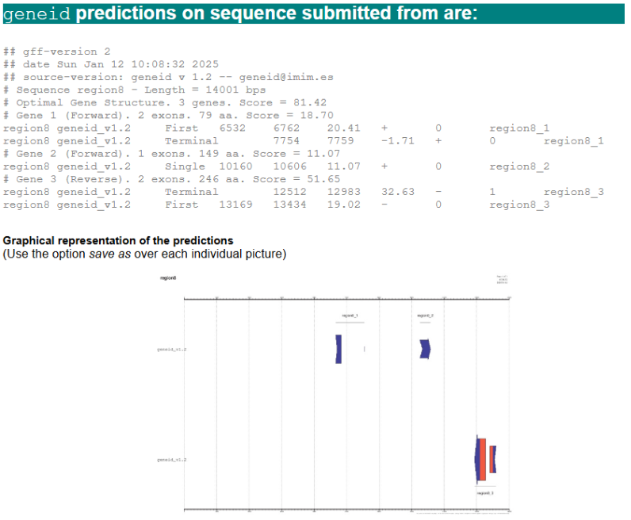

#### AUGUSTUS


The AUGUSTUS gene prediction tool (version 3.3.3) analyzed a 14,001 bp sequence using the wheat parameter set and identified two genes, one on the forward strand and one on the reverse strand. Gene 1 on the forward strand, extends  from 6226 to 10861 and contains two exons separated by an intron. The start codon is located in exon 1 (6532–6534), while the stop codon is in exon 2 (10604–10606). The coding sequence (CDS) includes two segments: 6532–6762 and 8714–10606. Gene 2, on the reverse strand, spans positions 12415–13535 and also contains two exons with an intron between them. The stop codon is in exon 1 (12512–12514), and the start codon is in exon 2 (13432–13434). The CDS includes two regions: 12512–12983 and 13169–13434. Both genes encode functional proteins. This detailed output highlights exon-intron boundaries, coding regions, and predicted protein sequences, which are valuable for downstream analyses like functional annotation and experimental validation.

#### DNA Subway AUGUSTUS


The AUGUSTUS tool identified two genes, g1 and g2, in the wheat sequence wheat_53611. Gene 1, located on the forward strand, spans positions 6532–10606 with a length of 4075 bp and a high prediction score of 0.87. It consists of four exons, with CDS regions ranging from 6532–6762, 8714–8738, 8824–8920, and 8992–10606. Gene 2, located on the reverse strand, spans positions 12512–13440 with a length of 929 bp and a prediction score of 0.54. It contains two exons, with CDS regions spanning 12512–12983 and 13169–13440. These predictions highlight the structural details of both genes, including exon-intron boundaries and coding sequences, which are critical for downstream analyses such as functional annotation and protein prediction.

#### DNA Subway FGENESH


The FGENESH tool identified two genes, gf001 and gf002, in the wheat sequence wheat_53611. Gene gf001, located on the forward strand, spans positions 6532–10606 with a length of 4075 bp. It consists of two exons, the first spanning 6532–6762 (231 bp, score 21.81) and the second spanning 8714–10606 (1893 bp, score 120.25). Both exons contribute to the coding sequence (CDS). Gene gf002, located on the reverse strand, spans positions 12512–13434 with a length of 923 bp. It contains three exons: the first spans 12512–12727 (216 bp, score 9.77), the second spans 13072–13120 (49 bp, score -7.58), and the third spans 13169–13434 (266 bp, score 33.00). These detailed annotations provide insights into gene structures, exon positions, and strand orientation, making them valuable for downstream analysis and functional studies.

| Gene Position | Fgenesh (exons)         | DNA Subway Fgenesh (exons) | Augustus (exons)           | DNA Subway Augustus (exons) | Geneid (exons)            |
|---------------|-------------------------|----------------------------|----------------------------|-----------------------------|---------------------------|
| **Gene 1**    | 1301–3168 (-) (7 exons) | 6532–10606 (+) (2 exons)   | 6226–10861 (+) (2 exons)   | 6532–10606 (+) (4 exons)    | 6532–7759 (+) (2 exons)   |
| **Gene 2**    | 5715–6797 (-) (2 exons) | 12512–13434 (-) (3 exons)  | 12415–13535 (-) (2 exons)  | 12512–13440 (-) (2 exons)   | 10160–10606 (+) (1 exon)  |
| **Gene 3**    | 8741–10606 (+) (1 exon) | -                          | -                          | -                           | -                         |
| **Gene 4**    | 12512–13440 (-) (2 exons) | -                          | -                          | -                           | 12512–13434 (-) (2 exons) |


**Common regions**:

- **Gene 1** (green region) : The gene spanning from 6532 to 10606 on the forward strand (+), marked in green in the results of the DNA subway Fgenesh, is a consistent feature across multiple gene prediction tools but with some variations. Augustus and DNA subway augustus predict this gene at a slightly extended position from 6226 to 10861 with 2 exons for augustus and from 6532 to 10606 with 4 exons for DNA subway augustus.
Geneid also identifies this region but divides it into two separate predictions: one from 6532 to 7759 (2 exons) and another one from 10160 to 10606 (1exon). This split in Geneid’s prediction suggests  a possible alternative structure or fragmentation. FGENESH, while differing in interpretation, may be representing the same gene with variation, as it predicts a single-exon gene extending from 8741 to 10606 (the green region) on the forward strand, aligning with the green region predicted in the other tools.  
For the other region predicted by FGENESH that extends from 5715 to 6797 ( the blue region ) on the reverse strand (-) with 2 exons, it is not supported by the other tools. This region may partially overlap with predictions made by tools that focus on nearby regions but it does not appear explicitly as a standalone gene in the results of tools like AUGUSTUS or GENEID or DNA subway Fgenesh.
- **Gene 2** (yellow region) : the gene extending from 12512 to 13434 on the reverse strand (-) with 3 exons, marked in yellow in the results of the DNA subway Fgenesh, is a consistent feature across multiple gene prediction tools but with slight differences in exon count and exact positions. FGENESH predicts this region as a gene with 2 exons, extending from 12512 to 13440, aligning with the prediction of DNA subway Fgenesh. Augustus predicts this region as a gene spanning from 12415 to 13535 with 2 exons, slightly extending the boundaries compared to FGENESH. GENEID matches closely with FGENESH, predicting this gene at 12515 to 13434 with 2 exons.
This consistency in identifying this region across tools indicates that it is a reliable gene prediction, with the variations in exon count and precise start-end positions reflecting the differences in each tool’s algorithm.
	
**Non common regions**:

The region highlighted in _pink_ (1301-3168 on the reverse strand) is a unique prediction made exclusively by FGENESH. According to FGENESh, this region has 7 exons starting from 1301 and ending at 3168. This prediction is not supported by any of the other tools used in the analysis, such as DNA Subway FGENESH, AUGUSTUS or Geneid which do not identify a gene in this specific region.
The lack of agreement from other tools suggests that this region might be an artifact of the FGENESH algorithm, a false positive, or a region with characteristics that make it detectable only by FGENESH. Alternatively, it could represent a low-confidence or poorly conserved gene that is difficult for other tools to detect

$\iff$ These variations between the tools highlight the need for further investigation, validation as through transcriptomic data, to confirm the existence, structure, and functionality of these predicted genes and to ensure biologically meaningful results.


> p.s. In order to visualize the features predicted by the abovementioned tools on artemis we first need to convert them to `.gff` format.

<!--  -->


## Gene Validation

### BLAST

We will perform a BLAST search of the predicted genes against related species proteomes locally, using blast+ package on unix terminal. 

> Blasting done through `blastp` program on the predicted genes from region8 (each tool generated .faa fasta file that is amino acid sequences, each sequence will be a query).  

The proteomes were retrieved from UniProt as it is recommended to be the way to download proteome for a whole species by an EMBL-EBI training course on UniProt[^7], we will provide an api to retrieve the sequences as well to make our work replicable.  

Since we're blasting against local databases built from proteomes retrieved from UniProt, the resulting hits have UniProt IDs, instead of product or gene names, thus an extra processing step was taken to annotate the results through a python script using `biopython`'s `ExPASy` and `SwissProt` modules.

> On another note, the advantages of blasting locally here on particular species is it's more specific and centered towards the species of interest, and provides a larger set of similar proteins in comparison to swissport for instance, which has a very limited number of reviewed proteins in each of the species we are interested in, which will be noted in the results.

#### Tritium aestivum proteome

To validate the predicted genes, we will start of by blasting against the proteome of _Triticum aestivum_ available on UniProt. We retrieved the list of proteins from the supplementary material of an International Wheat Genome Sequencing Consortium (IWGSC) published in _Science_[^5] aiming to provide an annotated reference sequence of the _Triticum aestivum_ genome. The article is available [here](https://europepmc.org/article/MED/30115783). We will access all the proteins sequences (including isoforms) using an api call to the UniProt database.

```bash
$ curl https://rest.uniprot.org/uniprotkb/stream?compressed=true&format=fasta&query=%28%28lit_pubmed%3A30115783%29%29 \
    > data/sequences/proteome/Triticum_aestivum_proteins.fasta.gz
$ gunzip data/sequences/proteome/Triticum_aestivum_proteins.fasta.gz
$ cat data/sequences/proteome/Triticum_aestivum_proteins.fasta | grep '>' | wc -l 
130283
```
There is a total of 130,283 proteins in the file. 

We create the database locally, in `data/database`:  
```bash
## --creating the local database
## 1. Tritium_aestivum_proteome
makeblastdb -in data/web_retrieved_sequences/proteins.fasta \
            -dbtype prot \
            -out data/database/Triticum_aestivum_proteome/Triticum_aestivum_proteome
```

We will now perform a BLAST search against this database to see if our predicted genes are similar to any of the known annotated proteins of _Triticum aestivum_. It'll be a blastp search, as we are looking for protein sequences that are similar to our predicted sequence (which is already translated by our tools output and saved in out repository in .faa files)

```bash
## a. on AUGUSTUS_predicted.faa output
blastp -query output/AUGUSTUS/AUGUSTUS_predicted.faa \
       -db data/database/Triticum_aestivum_proteome/Triticum_aestivum_proteome \
       -out output/blast/tabulated/AUGUSTUS_Triticum_aestivum_proteome_results.txt \
       -outfmt 6 
       #tabulated output
```

Then, using biopython uniprot api again, we will annotate the results to have a better understanding of the hits, as the proteome contain solely IDs and sequences. And for that we created a python script to clean the blast results and add the uniprot annotation to it, running it this way:

```bash
python src/clean_blast_results.py output/blast/tabulated/AUGUSTUS_Triticum_aestivum_proteome_results.txt
``` 


We provided the commands to make blast databases and perform all the search we've done in out analysis in the [`blast.sh`](https://github.com/raysas/wheat-seq-annotation/src/blast.sh) script.
```bash
./src/blast.sh # to run all the blast commands
```

<!-- This is the main commands to follow, doen 3 times (for this species, and the 2 related species) for each of the predicted genes from each of the tools:  

```bash
## --creating the local database
## 1. Tritium_aestivum_proteome
makeblastdb -in data/web_retrieved_sequences/proteins.fasta \
            -dbtype prot \
            -out data/database/Triticum_aestivum_proteome/Triticum_aestivum_proteome

## -- blasting predicted genes against the local database
## a. on AUGUSTUS_predicted.faa output
##      i. tabulated output
blastp -query output/AUGUSTUS/AUGUSTUS_predicted.faa \
       -db data/database/Triticum_aestivum_proteome/Triticum_aestivum_proteome \
       -out output/blast/tabulated/AUGUSTUS_Triticum_aestivum_proteome_results.txt \
       -outfmt 6 

##    ii. clean tabular output and add uniprot annotation
python src/clean_blast_results.py output/blast/tabulated/AUGUSTUS_Triticum_aestivum_proteome_results.txt
``` -->


#### Related species

Starting from the following information:  
- _Triticum monococcum_ and _Triticum durum_ have the A and B chromosomes  
- _Aegilops tauschii_ has the D chromosome

We will also look for their proteomes and perform the same blasting procedure as above.  

**N.B**: we couldn't find _Tri. monococcum_ proteome on UniProt, so we will only blast against _Tri. durum_ for the common A and B chromosomes.

##### Triticum durum

The proteome can be find on [this UniProt page](https://www.uniprot.org/uniprotkb?query=%28taxonomy_id%3A4567%29), 188,826 proteins, worth noting that only 2 of them are expertly reviewed - Swiss-Prot - the rest are unreviewed - TrEMBL.

For _Triticum durum_, retrieving the proteome through this api call:
```bash
$ curl https://rest.uniprot.org/uniprotkb/stream?compressed=true&format=fasta&query=%28%28taxonomy_id%3A4567%29%29 \
    > data/sequences/proteome/Triticum_durum_proteins.fasta.gz  
$ gunzip data/sequences/proteome/Triticum_durum_proteins.fasta.gz
```

##### Aegilops tauschii

The proteome can be find on [_this UniProt page_](https://www.uniprot.org/uniprotkb?query=%28taxonomy_id%3A200361%29),  214,193 proteins, only one of them is expertly reviewed.

Retrieving the proteome through this api call:
```bash
$ curl https://rest.uniprot.org/uniprotkb/stream?compressed=true&format=fasta&query=%28%28taxonomy_id%3A200361%29%29 \
    > data/sequences/proteome/Aegilops_tauschii_proteins.fasta.gz
$ gunzip data/sequences/proteome/Aegilops_tauschii_proteins.fasta.gz
```

#### Results

In this results section we are, as explained, expecting to have for each predicted gene 3 blasting results. Since we're taking into consideration 4 genes from FGENESH and 2 from AUGUSTUS and blasting against 3 species' proteomes separately (T. aestivum, A. tauschii and T. durum), we would have 6 genes to analyse with 3 resulting blast output each.
_BLAST results can be found by clicking on_: [this link](https://docs.google.com/spreadsheets/d/e/2PACX-1vQ6sFI7_zIcU4x-ERs4ahNpiV46N476MYhdP2flOJrLseTCKA2K9sRKfiYyfOwCnwzBz5Mdh5RYgJHr/pubhtml)  
_In the first reported blast we will analyse every single detail extensively to give an intuition of our analysis_

##### **Augustus gene 1**: (_protein length: 707aa_)  


In the first BLAST results for AUGUSTUS against our own species's proteome _Triticum aestivum_:  
We find the top 5 hits quite significant with % id higher than 98.7% and then immediately drops to 52% after these 5 matches from the proteome database, providing an e-value estimated by blast+ to be 0 which is quite significant, thus we will be considering them as top results. Looking into them, we find the 1st hit to be 100% id, found on chromosome 4D, matching all of the protein's length (1-707 residues) against the full length of the subject from the database (also 1-707) with NO mismatches NO gaps, and this exact match gives a product: _Anaphase-promoting complex subunit 11 {ECO:0008006|Google:ProtNLM}, with gene name CFC21_063427 (as retrieved from uniprot's api)_  

a snippet of the blast results and retrieved information for this hit:  

- **Transcript ID:** AUGUSTUS_g1.t1
- **Protein ID:** tr|A0A3B6JR29|A0A3B6JR29_WHEAT
- **Alignment Score:** 100
- **Query Length:** 707
- **Mismatch Count:** 0
- **Gap Count:** 0
- **Query Start:** 1
- **Query End:** 707
- **Subject Start:** 1
- **Subject End:** 707
- **E-value:** 0
- **Bit Score:** 1462
- **Protein Name:** RecName: Full=Anaphase-promoting complex subunit 11 {ECO:0008006|Google:ProtNLM}
- **Chromosome:** Chromosome 4D
- **Organism:** Triticum aestivum (Wheat)
- **Organism Protein ID:** A0A3B6JR29_WHEAT
- **ORF Names:** CFC21_063427_063427 {ECO:0000313|EMBL:KAF7055962.1}
- **Keywords:** Metal-binding, Reference proteome, Zinc, Zinc-finger  


All the hits follows have the same product name, same gene name and aroudn same length (707 or 708 due to inserted gap). We can notice that not all of them are on the several hits can be due to:  

- duplication  
- isotopes (not an expertly reviewed database liek swissprot)  
- hits on the same protein sequence but different alignments patterns

Having the match 100% id to the first protein is a validation besides all the above mentioned signs from results (consistency of the matched proteins among the best hit), meaning that this gene moght be infat the CFC21_063427 gene, and the protein is the Anaphase-promoting complex subunit 11.   
More interestingly it resides on the chromosome 4D, which is the chromosome we have mapped our region to, which provide a stringent evidence of our corelated work.


The 2nd blast is done on _Aegilops tauschii_ proteome:  

we find the 1st hit to be 100% id, matching all of the protein's length (1-707 residues) against the full length of the subject from the database (also 1-707) with only 5 mismatches, and this exact match gives a product: _Anaphase-promoting complex subunit 11 {ECO:0008006|Google:ProtNLM} (as retrieved from uniprot's api)_  

<!-- ##################### -->

The 3 hits that follows are truncated to be around 600 residues of length (630, 629, 621 respectively) and 4 mismatches beginning at around 78-87th position of the query until the end, each corresponding to these proteins: _Anaphase-promoting complex subunit 11 (twice) and VWFA domain-containing protein {ECO:0008006|Google:ProtNLM}_.  

And the last hit is strictly a small segment from the first  388 residues of the query corresponding to _RING-type domain-containing protein {ECO:0008006|Google:ProtNLM}_,
which can be a suggesting that the first part of the query contains this particular domain.  

Even though the annotations are quite different, 2 interesting things are worth noting: All of them are metal-binding domains containing proteins relating to zinc and zinc-fingers, as can be seen from the list of keywords extracted from uniprot from the hit id, thus showing even though there is no consensus towards the annotation there is majority agreement on the functionality and domains of this sequence product:  


> N.B. proteins all show to be on the same segment (chromosome), now it's worth noting that these are not expertly annotated as found in databases like swiss port, but overall these proteins are very highly similar between each other too. 

<!-- ########### -->


Next one with _Triticum durum_ proteome,
which only has A and B chromosome (and in our case we have a D chromosome)
but also showed 3 significant results belonging to the same protein (CFC21_063427 gene), the 1st 2 of the same length belonging to different chromosomes providing evidence to presence of duplicates maybe. 

On a side note:  

- the fact that the same protein is found in 4D of our species and 4D of _Aegilops tauschii_ enforces an evolutionary interspecies link (also in our region which turned out to be on 4D, this is a bonus finding)  
- It is also perceived in the other species, _Triticum durum_, that only has the A and B which is a sign of conservation of this protein among the genus of _Triticum_, implying its importance maybe in this organism.

---

All these blast results show that indeed this gene1 is highly likely to be associated with the _Anaphase-promoting complex subunit 11_ protein, belonging to the 4D chromosome of our species, and there exist general agreement of the use of is full length (707aa) and is associated with a zinc-finger motif along with metal-binding activity (zinc most probably), with 100% match to the same protein product from our own species. We shall see other results to see the validity of our assumptions

##### **Augustus gene 2**: (_protein length: 245aa_)  


_Against Triticum aestivum proteome_

Results firstly show 100% match of the first 245 residues of _Uncharacterized protein {ECO:0000313|EMBL:KAF7055961.1, ECO:0000313|EnsemblPlants:TraesCS4D02G339100.1}_, activity in DNA binding and transcription regulation, localized subcelluraly in the nucleus which might indicate its possibility to be a transcription factor. The aligned subject starts at 3rd residue, protein of length 247 indicating a possible mistake in the prediction of the gene length by AUGUSTUS.

The other 2 hits also have high % match (>95), same query length and position mapped but differ only in the start position of the subject protein and the chromosome location (do not map in 4D) suggesting possible duplicates. 


_Aegilops tauschii_

Only one significant hit, same position as found previously 1-245, same exact annotation of the _Uncharacterized protein_ with transcription involving function found on chromosome 4D of this species (showing evolutionary conservation).


_Triticum durum_

Same results almost, same positions are aligned (1-245), same functional annotation, compartmentalization (in nucleus) for 2 hits on respectively 5b and 4a chromosomes (near 4d position wise on whole genome). Also this uncharacterized protein provides evidence on the structural annotation of these 245 residues of our genomic region done by AUGUSTUS


_Thus the 2nd prediction of AUGUSTUS is also highly likely to be validated, with provided proof on conservative 245 residues involved in dna binding activity_

##### **Fgenesh gene 1 & 2**  

Show absolutely no significant results in each of the species, one of them no hits at all, those that have have a higher proportion mismatches than matches, high e value and % id <40. Thus no validation of these gene structures predicted by Fgenesh

##### **Fgenesh gene 3** (length: 621aa)  

This one provides interestingly similar results that also enforce our previously established hypothesis in the first Augustus gene:

_Triticum aestivum_ 

5 hits above 92%, all of them against the same protein (the _Anaphase-promoting complex subunit 11_)  
Localized on chromosome 4D, matching the same length of our query (make sure) 1-621 in all 5 hits to different positions of the subject starting either at 67th or 76th residue with different alignment gaps and mismatch patterns

> a more subtle hypothesis then having the same exact protein of different versions in the same place is having it align to the same protein entry, but we can not assume that especially that each of these 5 proteins has a different UniProt ID

_Aegilops tauschii_

These show similarity to AGUSTUS gene 1 results against this species' proteome. 4 hits of exactly 99.345% identity, the length is similar to previously reported (1-621 of query except the last one is 1-620) showing matches to respectively: _VWFA domain-containing protein_ & _Anaphase-promoting complex subunit 11_ (x2)  
Also all metal bonding activity and present on 4D chromsome of this genome  (matches with Augustus prediction)

_Triticum durum_

These results show top 3 >92% id with Anaphase-promoting complex subunit 11, also 1-621 against 87-707 of 2 subjects and 87-670 of the 3rd one. Thus promoting the same resulting conclusion

For this gene Fgenesh3, we would like to refer back to the analysis for Augustus gene 1 as something interesting is happening:

As previously stated from gene prediction results, these 2 predicted genes might be attempts to map the same gene, which is validated here through their mapping of Anaphase.. with high %id emphasising this segment's functionality 

we can notice that August's prediction match the 1-707 of subject while Fgenesh start at either 67 or 76th residue of the subject, both matching the length of the predicted genes length (707 vs 621 residues), we can comment that Fgensh has a truncated prediction at the 5' UTR which is supposed to be part of the product.
(We can say that the 621 aa residues have been well predicted in the coding region, there might be a truncated chunk at the beginning of the protein as predicted by Fgenesh as the matches are late to start on subject proteins and when put in comparison with the length and alignment of Augustus's)

#### **Fgenesh gene 4** (length: 247aa)  

Finally, we have here in _Triticum aestivum_ proteome, 3 hits with 100% id, 247 residues of the query matching the same length of the subject, all of them are _Uncharacterized protein_ but with same identifiers involved with ECO and such (also identifiers relatd to DNA-binding) with the same functional annotation, the 100% match is with subject on 4D the other 2 are respectively 4B and 5A which are closest to 4D in position, with the same exact alignment pattern, no mismatches, no gaps, and the same exact length of the protein.

2 further hits in _Triticum durum_ and 1 in _Aegilops tauschii_ show the same results.

Worth noting this matches with subject protein's length and further validates Augustus results, but even better with the 2 first missing residues that we have mentioned before present here, thus highly suggesting the presence of a coding region here.

### Transcriptome 

_Testing if we can find any transcriptome data_

The [_European Nucleotide Archive (ENA)_](https://www.ebi.ac.uk/ena/browser/home) comprises a large collection of sequencing data from raw sequences to assembly to functionally annotated ones. While looking for [transcriptome studies for _Triticum aestivum_](https://www.ebi.ac.uk/ena/browser/view/Taxon:4565) we find several projects (Total= 22, in this table[^1]) 

_TSA stands for Transcriptome Shotgun Assembly_

One of them is published by [Xiao et al. (2013) in BMC Genomics](https://bmcgenomics.biomedcentral.com/articles/10.1186/1471-2164-14-197) [^2]. They have performed short read RNA-seq using Illumina Hi-Seq tech, and deposited the project's raw reads on the SRA database, project [`SRX212270`](https://www.ncbi.nlm.nih.gov/sra/?term=SRX212270). We will use this as trial to explore how we can validate using Whole Transcriptomes before optimizing our choice. 
While running out of time and memory, we will try doing that using Galaxy[^3][^4].


Working on galaxy, first retrieve the SRA accession number from the project, tools > Get data > EBI SRA, copy the accession number and get the fastq in galaxy. After loading them (paired end so 2 fastq) > fastq groomer, to make sure the fastq format fits Galaxy's requirement and make it run. Meanwhile > FastQC to make sure the quality of the transcriptome is good or whether it's better to take another set of reads.

We will try now mapping: using Tophat2, we will map the reads to the reference genome of _Triticum aestivum_ (available on ENSEMBL) to see how many reads are mapped and how many are not. We have taken the reference genome using 

_trying to perform RNA-seq aln and viz using IGB, no reads show_  

We also tried performing mapping through RNA Star, which is a splice aware and fast performing aligner, but the results were not satisfactory, also no reads were shown in the region of interest.

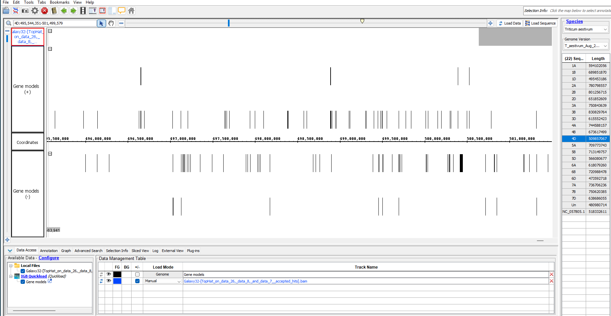

After all, we have used over 80GB of memory for over 60 hours of computing on Galaxy server, we were in fact no longer able to proceed with RNAseq analysis.

On the other hand we found this on NCBI, when we mapped our region to its coordinates on the reference of chromosome 4D, and we found the following:

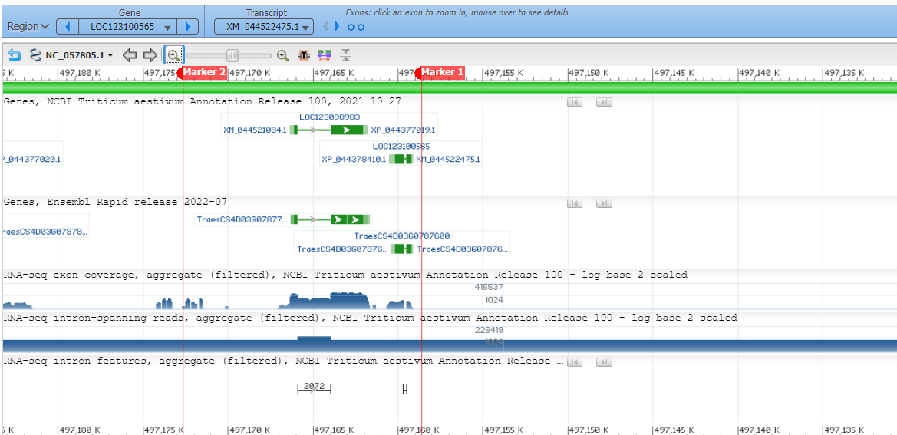

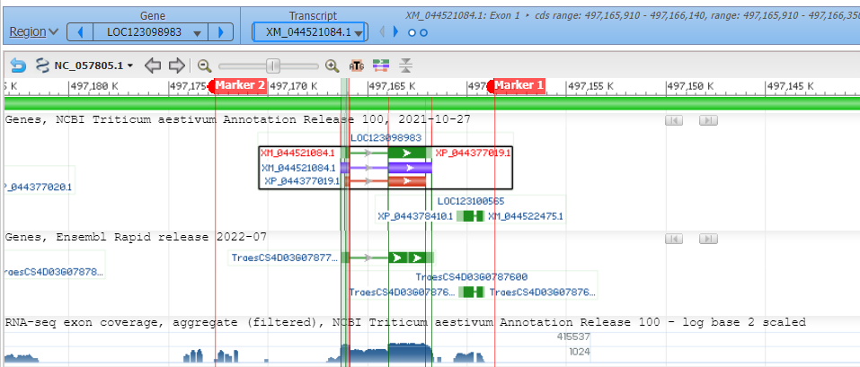

One transcript was shown with some exon RNAseq exon density in the region, providing some hope that this region can actually contain a gene, even though the transcript does not map exact locations that we have. But overall, this is a good sign that the region is transcribed and can contain a gene (or more).

<!-- 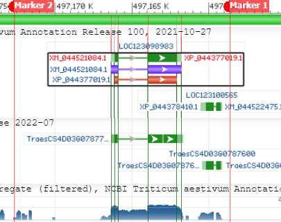 -->

<!-- | | | 
|-|-|
|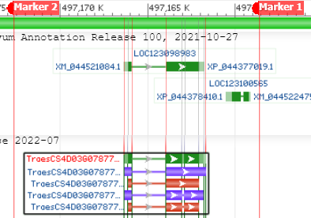 | | -->


_Another trial_:

cDNA (complementary DNA) is a single-stranded DNA synthesized from a messenger RNA (mRNA) template in a reaction catalyzed by the enzyme reverse transcriptase. It is thus synthesized from the mRNA template, it can be used to study the gene expression in a cell, as it is a copy of the mRNA, and can be used to study the gene expression in a cell. It's a representation of a gene's transcript.  
On Ensembl Plants, we can find the cDNA of _Triticum aestivum_ [_here on this ftp site (click link)_](https://plants.ensembl.org/Triticum_aestivum/Info/Index). There is one fasta file containing all of the genome's cDNA sequences, with a particular header format. To make the process more easily computable, we wrote  a bash script to filter the cDNA sequences of the chromosome 4D (can be found in `./src/filter_cDNA.sh`) , and save them in a separate file. After that, we retrieved only 2 cDNA sequences:

```text
>TraesCS4D02G339400.1 cdna chromosome:IWGSC:4D:497165754:497169019:-1 
AGCCCCACCCATTTCCTTCCCTTCGGTCGAGGAAGGCAGCAGCAATAAATCTAGGTCCGG
>TraesCS4D02G339300.1 cdna chromosome:IWGSC:4D:497150642:497160941:-1 
CTTCAAGAGATGGAGATCCCTGACCAGCAGCCTGCGGTCGCAGTCGCAGAGATGGAAGCC
```

Also showing an output out of the studied region, even though none of them directly validates any of our predictions.

> We tried looking for ESTs too but couln't find, however we did not try as extensively as RNA this is why it's not mentioned

## Transposable Elements (TEs) 

To detect transposable elements (TEs) in the genomic region of *Triticum aestivum* (wheat), we used the following tools:

- RepeatMasker software with the TREP database considering first the Triticum genus only and then the complete database.
- Censor from Genetic Information Research Institute (GIRI) website, considering first the Triticum genus and then the Viridiplantae.
- RepeatMasker included in DNA Subway.

### RepeatMasker

[RepeatMasker Website](https://www.repeatmasker.org/RepeatMasker/)

RepeatMasker is a program that screens DNA sequences for interspersed repeats and low complexity DNA sequences. It can be used to identify transposable elements (TEs) in genomic sequences.

#### Prerequisites

1. **Perl**:

    Verify that Perl version 5.8.0 or higher is installed:
    ```bash
    perl -v
    ```
    If not installed, run:
    ```bash
    sudo apt update
    sudo apt install perl
    ```

2. **Python 3 and h5py Library**:

    Verify that Python 3 is installed:
    ```bash
    python3 --version
    ```
    Then, install the `h5py` library:
    ```bash
    sudo apt install h5py
    ```

3. **Sequence Search Engine: RMBlast**:

    We will use **RMBlast**, a RepeatMasker-specific version of NCBI BLAST, which is optimized for repeat detection and recommended for use with RepeatMasker, particularly for complex genomes like *Triticum aestivum* ([RMBlast Website](https://www.repeatmasker.org/rmblast)).

    Download RMBlast:
    ```bash
    wget https://www.repeatmasker.org/rmblast/rmblast-2.14.1+-x64-linux.tar.gz
    ```
    Extract and move it to the system's PATH:
    ```bash
    tar zxvf rmblast-2.14.1+-x64-linux.tar.gz
    sudo mv rmblast-2.14.1 /usr/local/bin/rmblast
    ```
    Remove the downloaded tar file:
    ```bash
    rm rmblast-2.14.1+-x64-linux.tar.gz
    ```

4. **Tandem Repeat Finder (TRF)**:  

    Download TRF:
    ```bash
    wget https://github.com/Benson-Genomics-Lab/TRF/releases/download/v4.09.1/trf409.linux64
    ```
    Make the file executable and move it to the system's PATH:
    ```bash
    chmod +x trf409.linux64
    sudo mv trf409.linux64 /usr/local/bin/trf
    ```

---

#### Installation

1. **Download RepeatMasker**:  

    The latest version is **RepeatMasker-4.1.7-p1.tar.gz**. To download the file in the /usr/local directory:
    ```bash
    cd /usr/local/
    sudo wget https://www.repeatmasker.org/RepeatMasker/RepeatMasker-4.1.7-p1.tar.gz
    ```

2. **Unpack the Distribution**:  

    Unpacking it to `/usr/local/` directory:
    ```bash
    sudo gunzip RepeatMasker-4.1.7-p1.tar.gz
    sudo tar xvf RepeatMasker-4.1.7-p1.tar
    sudo rm RepeatMasker-4.1.7-p1.tar
    ```

3. **Run the Configure Script**:  

    ```bash
    cd /usr/local/RepeatMasker
    sudo perl ./configure
    ```

4. **Install RepeatMasker Libraries**:  

    We installed Dfam Viridiplantae partition database but it required a lot of space and time to use. Also, for the RepBase database it requires subscription. So we will use the **TREP Database**.

    **TREP Database**:

    TRansposable Elements Platform (TREP) is a curated collection of transposable elements (TEs) originally focused on **Triticeae species** (wheat, barley, maize), but has expanded to include TEs from various other species. This database is essential for identifying, classifying, and masking TEs in genomic sequences ([TREP Database](https://trep-db.uzh.ch)).

    To download the necessary TREP database files:

    1. **Triticum sequences**  
        This database contains sequences specific to *Triticum* genus.
        ```bash
        sudo wget https://trep-db.uzh.ch/blast/dir_download/sequences.zip -P \
        /usr/local/RepeatMasker/Libraries/
        ```

    2. **Complete TREP nucleotide sequence database (4,162 sequences)**  
        This database includes all TE entries for detailed analysis.
        ```bash
        sudo wget \
        https://trep-db.uzh.ch/downloads/trep-db_complete_Rel-19.fasta.gz \
        -P /usr/local/RepeatMasker/Libraries/
        ```

    To extract the files:

    ```bash
    cd /usr/local/RepeatMasker/Libraries/
    sudo unzip sequences.zip
    sudo gunzip trep-db_complete_Rel-19.fasta.gz
    ```

---

#### Usage

1. **RepeatMasker with Triticum sequences from TREP database:** 

    ```bash
    RepeatMasker -lib /usr/local/RepeatMasker/Libraries/sequences.fasta \
                -dir /home/joelle/M1/Structural_Genomics/triticum_sequences \
                /home/joelle/M1/Structural_Genomics/region8.fasta.txt
    ```
    `-lib`: Specifies the library file to use for masking.   
    `-dir`: Specifies the output directory for the results.  
    `-region8.fasta.txt`: The input file containing the genomic sequence to analyze.  

    The output file region8.fasta.txt.out contains the following information:

    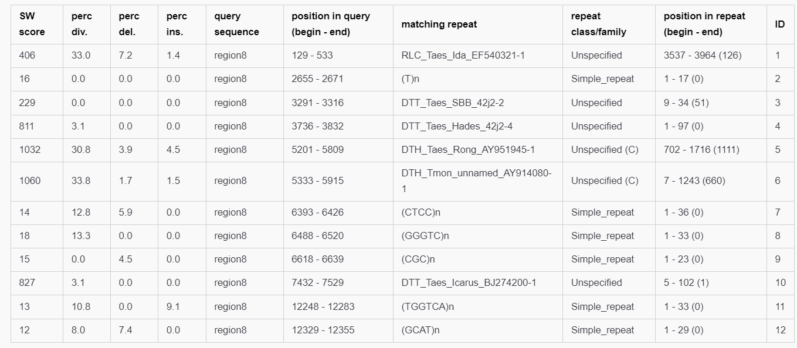

    - **SW score**: Smith-Waterman score.
    - **perc div.**: Percentage of substitutions in the alignment.
    - **perc del.**: Percentage of deletions in the alignment.
    - **perc ins.**: Percentage of insertions in the alignment.
    - **query sequence**: Name of the query sequence.
    - **position in query (begin - end)**: Position of the alignment in the query sequence.
    - **matching repeat**: Name of the matching repeat.
    - **repeat class/family**: Class and family of the matching repeat.
    - **position in repeat (begin - end)**: Position of the alignment in the repeat sequence.
    - **ID**: Unique identifier for the alignment.

2. **RepeatMasker with the complete TREP database**:

    ```bash
    RepeatMasker -lib /usr/local/RepeatMasker/Libraries/trep-db_complete_Rel-19.fasta \
                -dir /home/joelle/M1/Structural_Genomics/trep-db_complete_Rel-19 \
                /home/joelle/M1/Structural_Genomics/region8.fasta.txt
    ```

    The output file region8.fasta.txt.out:

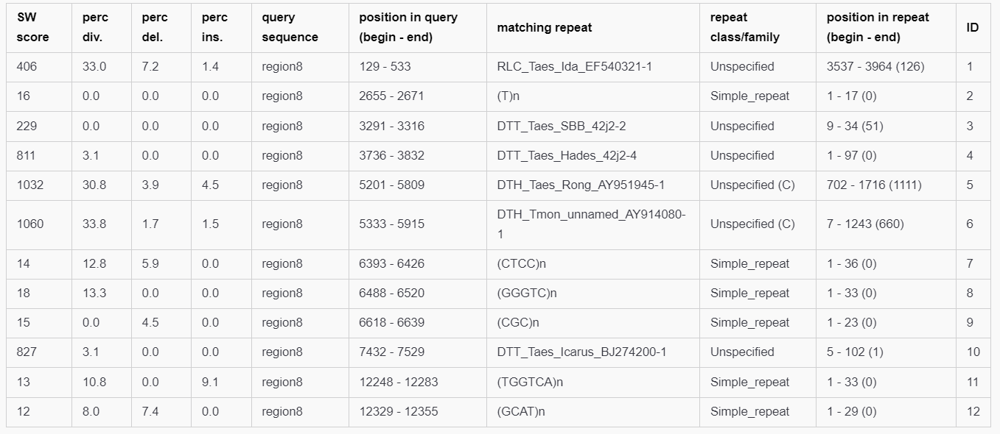


### Censor

[Censor website](https://www.girinst.org/censor/index.php)

Censor is a tool provided by the Genetic Information Research Institute (GIRI) that screens DNA sequences for interspersed repeats and low complexity DNA sequences. It uses Repbase, a database of repetitive DNA elements, to identify transposable elements (TEs) in genomic sequences.

1. **Censor with Sequence source set to Triticum genus**:

    The output can be found here: [Censor Triticum genus output](https://www.girinst.org/cgi-bin/censor/show_results.cgi?id=1455804&lib=Triticum#ALN-region8)

    SVG Plot and table output:

    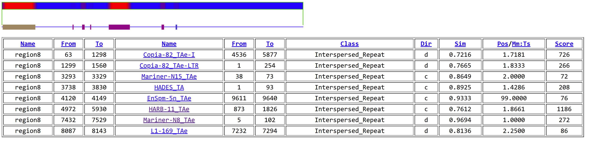

    - **Name**: The name of the genomic region or sequence being analyzed.
    - **From**: The starting position of the sequence in the input genomic region.
    - **To**: The ending position of the sequence in the input genomic region.
    - **Name (Repeat)**: The name of the identified repeat element within the sequence.
    - **From (Repeat)**: The starting position of the repeat sequence in the genomic region.
    - **To (Repeat)**: The ending position of the repeat sequence in the genomic region.
    - **Class**: The type or class of the repeat element (e.g., Interspersed_Repeat, Simple_repeat).
    - **Dir**: The orientation of the repeat element relative to the genomic sequence ('d' for direct, 'c' for complementary).
    - **Sim**: The similarity score between the repeat sequence and the genomic region, indicating the match quality.
    - **Pos/Mm:Ts**: The positional or match/mismatch score, reflecting the alignment quality between the repeat and the sequence.
    - **Score**: A cumulative score indicating the strength or confidence level of the match between the repeat and the genomic region.

    The similarity scores are quite high, indicating a strong match between the identified repeat elements and the genomic sequence.

    The summary of the different classes of repeat elements identified in the genomic region:

    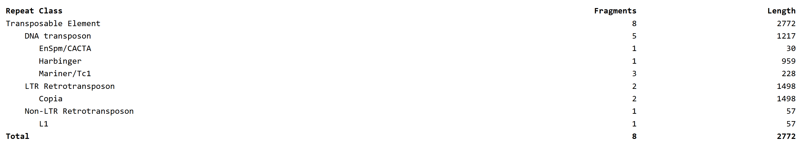

2. **Censor with Sequence source set to Viridiplantae**:

    The output can be found here: [Censor Viridiplantae output](https://www.girinst.org/cgi-bin/censor/show_results.cgi?id=1391652&lib=Viridiplantae).

    SVG Plot and table output:

    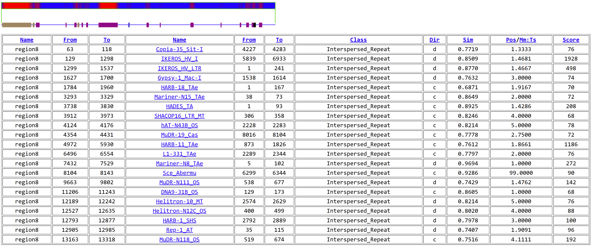

    Considering the Viridiplantae database, more repeat elements were identified, including those from other plant species. The similarity scores are also high, indicating significant matches between the repeat elements and the genomic sequence.

    The summary of the different classes of repeat elements identified in the genomic region:

    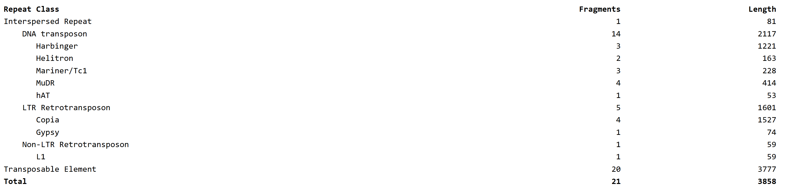

3. **Censor with Triticum sequences and forcing translated search**:

    The output can be found here: [Censor Triticum sequences and translated search output](https://www.girinst.org/cgi-bin/censor/show_results.cgi?id=1061034&lib=Triticum).

    SVG Plot and table output:

    

    By forcing a translated search, Censor can identify additional repeat elements that may not be detected in the standard nucleotide search. 
    Looking at the results, they are more fragmented and have relatively low similarity scores, except for the ones already identified previously.So we will not consider this output.


### RepeatMasker in DNA Subway

[DNA Subway Website](https://dnasubway.cyverse.org/)

DNA Subway is a bioinformatics platform that provides a suite of tools for analyzing DNA sequences, including RepeatMasker for identifying transposable elements (TEs).

The output table:

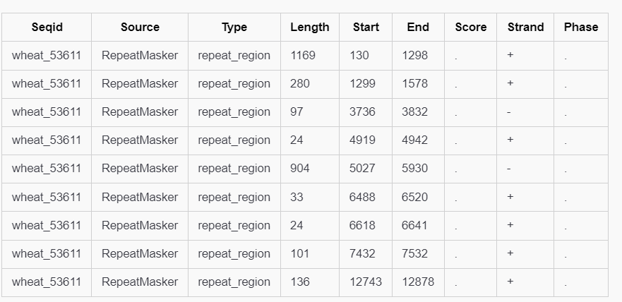

_check them in output/ directory in github for reference_

### Interpretation

A nice way to visualize the results and the difference between the tools 

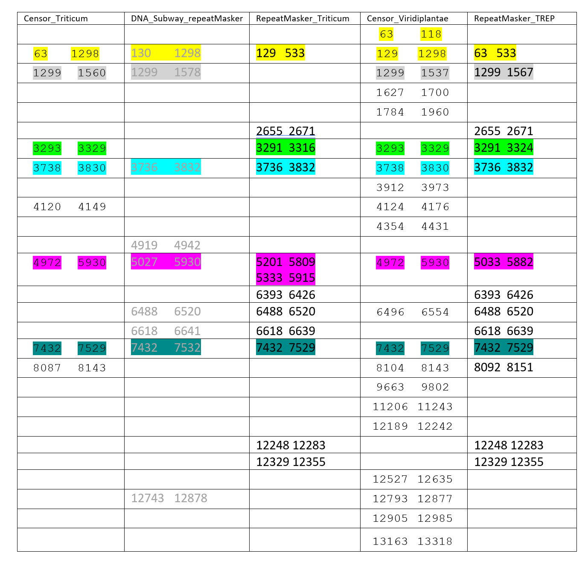

It contains the positions of the repetitive elements found by each tool in ascending order. We colored similar positions identified by different tools with the same color.

- Looking at the yellow cells, the start position 63 was agreed upon by Censor_triticum, Censor_Viridiplantae, RepeatMasker_TREP. The end position 1298 was agreed upon by Censor_triticum, Censor_Viridiplantae, and DNA Subway RepeatMasker. RepeatMasker_Triticum reported a TE inside this range but with a different start and end position, and noting that Censor_Viridiplantae reported same start and end but 2 fragments. While we cannot be sure of the exact positions, all the tools have agreed that there is a TE present in this region. If we look at the alignment provided by censor_triticum, it is globally relatively well aligned with the with `Copia-82_TAe-I`, annotated as LTR retrotransposon found in common wheat.

- The grey cells represent the positions where Censor_Triticum, DNA Subway RepeatMasker, Censor_Viridiplantae, and RepeatMasker_TREP agreed on the start position 1299 and end position with few nucleotides differences. The TE found by Censor_Triticum in this region is also `Copia-82_TAe-LTR`. 

- The green cells represent TE agreed upon by Censor and RepeatMasker. The sequence aligned to with 86% similarity using Censor is `Mariner-N15_TAe` annotated as DNA transposon, non autonomous, from Triticum Aestivum.

- The blue cells represent a TE where all the tools agreed on. While Censor gave it in the negative strand, RepeatMasker gave it in the positive strand, but DNA Subway gave it also in the negative strand. The sequence aligned there identified by the different tools is `HADES_TA`, also annotated by Censor_Triticum as Triticum aestivum non-autonomous DNA transposon. 

- The pink cells also represent a TE where all of them have identified. In censor it was aligned to `HARB-11_TAe` annotated as DNA transposon from Triticum Aestivum. In RepeatMasker Triticum, there are two TEs identified around this position, the second correspond to triticum monococcum and the first to triticum aestivum `DTH_Taes_Rong_AY951945-1` which is also DNA transposon. 

- For the last color, they also all agreed on it, with four of them identifying exactly same start and end positions, and they all identified it in the positive strand. It is also identified by both Censor `Mariner-N8_TAe` and RepeatMasker `DTT_Taes_Icarus_BJ274200` as DNA Transposon, Mariner superfamily. It is interesting to note that the first gene identified is from position 6226 to 10861 with intron positions: 6763-8713,
CDS1: 6532- 6762, CDS2: 8714-10606. Thus, the TE is found in the intron region of the gene.


- The TE at position 4120 to 4149 identified by Censor_Triticum is with 93% similarity to `EnSpm-5n_TAe` annotated as DNA transposon from Triticum Aestivum. This TE was not identified by RepeatMasker. It is worth noting that the alignment is small:   
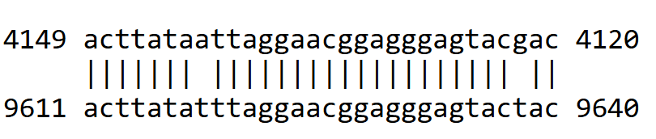  
but still might be considered as a valid TE. 

- The TE at position 8087 to 8143 identified by Censor_Triticum is with 81% similarity to `L1-169_TAe` annotated as Non-LTR retrotransposon from common wheat. Close positions were also identified by Censor_Viridiplantae and RepeatMasker_TREP.

- As for the other positions identified by RepeatMasker, they correspond mostly to simple repeats and low complexity regions. And for the other ones identified by Censor_Viridiplantae, they correspond to repeats from other species, with many intersecting with the positions of CDS. (Gene 2 positions:12512-13440, CDS1: 12512-12983, CDS2: 13169-13440). 

So, in conclusion, we can rely on the TEs identified by Censor using only Triticum sequences from the Repbase as they are well annotated and mostly agreed upon by the other tools, and we do not want to include other TEs from other species that we are not sure of.  


## Final annotation

Gene 1 of Augustus (predicted protein) which has a length of 707aa has shown to perfectly align with a subject of the protein **"Anaphase-promoting complex subunit 11"** which also has the same length, so this is our first final annotated gene, with positions as reported by AUGUSTUS:

| Feature        | Start   | End     |
|----------------|---------|---------|
| gene           | 6226    | 10861   |
| transcript     | 6226    | 10861   |
| exon           | 6226    | 6762    |
| start_codon    | 6532    | 6534    |
| initial        | 6532    | 6762    |
| terminal       | 8714    | 10606   |
| intron         | 6763    | 8713    |
| CDS            | 6532    | 6762    |
| CDS            | 8714    | 10606   |
| exon           | 8714    | 10861   |
| stop_codon     | 10604   | 10606   |
| tts            | 10861   | 10861   |

_What's Anaphase-promoting complex subunit 11?_

**keywords:** _Metal-binding, Zinc, Zing-finger, Anaphase-promoting complex subunit 11, RING_  
This is an unreviewed protein annotation (TrEMBL) with score 1/5, no structure has been experimentally determined which weaken its annotation status. 


It has a RING type and VWFA domains, 2 exons protein, and it has an 670 aa isoform (which explains hits of this length and possibly FGENESH's shorter prediction)


Gene 2 that we conclude is from FGENESH's gene4: **"Uncharacterized protein"** with a length of 247aa, has shown to align with a subject of the protein **"Uncharacterized protein"** which also has the same length, so this is our second final annotated gene, AUGUSTUS matched the last 245 aa of this protein. Positions as per FGENESH:  

| G Str | Feature | Start    | End      |
|---------|-------|---------|----------|
| -     | PolA    | 11635    |          |
| -     | 1 CDSl  | 12512    | 12983    |
| -     | 2 CDSf  | 13169    | 13440    |
| -     | TSS     | 13593    |          |

What's this ambiguous "_Uncharacterized protein_"?  

Getting back to this entry from it uniprot id, we notice it's involved in transcription regulation, DNA binding, and it's localized in the nucleus, it's poorly annotated as it is not reviewed (TrEMBL) and has a score of 1/5, no structure has been experimentally determined too.


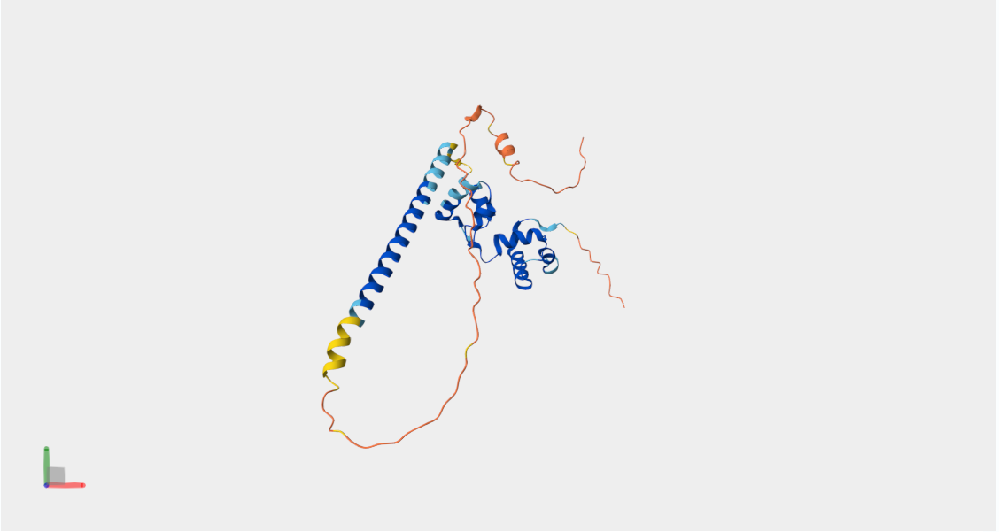


The final genes in `.fasta`:  

```text
>gene1   2 exons  6226  -   10881   707 aa, chain +
MADAWGRAKRALATKLCIRLPDRQRALEDAPPPPPPGREAHHPTTAVEAGPATGEEKARS
PSVSSRRLSSSGSRGSKRVCAICLGSMRTGHGQALFTAECSHKFHFHCITSNVRHGNHIC
PICRADWKELPFQGPQLADATHGRARVSPVNWPQDDGHMAVIRRLSNSYSGNLLEQFPVF
RTPEADIFNDDEQIDIQSETVEDSNAVTGSVEIKTYAEVQAIQQSVTQKVFSILIHLKAP
KSLESVSSRAPLDLVTVLDVSGSMKGAKLALLKKAMGFVIQTLGPNDRLSVIAFSSTARR
LFPLRQMNVNGRMQAMHAVNSLVDGGGTNISDGLKKGAKVIEHRRLKNPVCSIILLSDGQ
DTYSVPTFDDGVQTNHSMLVPPSILPGTGNHVQIHTFGFGADHDSAAMHAIAETSSGTFS
FIDAEGSIQNGFAQCIGGLLSVVVKEMRLGVECVDEGVVLTSIKSGGYASEVAVDGRNGS
VDIGDLYADEERGFLITLHVPAAQGQQTVLIKPSCTYQDAVTTESIQVHGSEVSVERPAY
SVDCKMSPEVEREWHRVQAMEDMSAARAAADGGDFSQAVSILEGRTRILESQAAQSSDSQ
CLALITELREMQERVESRRRYDESGRAFMLAGLSSHSWQRATARGDSTELNTQIHTYQTP
SMVDMLHRSQTLVPAVVEMLNRSPTVAPSRGSGRSVRSTKSFSERLA
>gene2   2 exons  12512  -  13440   247 aa, chain -
MAMDAMSSAVLQGAWRKGPWTALEDRLLTEYVQQQGEGSWNSVAKLTGLRRSGKSCRLRW
VNYLRPDLKRGKITADEETVILQLHAMLGNRWSAIARCLPGRTDNEIKNYWRTHFKKARP
SRRARAQLLHQYQLQQQQQHRQYLHALHLLQQQQQEMQMQLQMEQQTHQPQVMMMQQQSP
PEEDQAVITTVGNMNSMEAAECYCPCPAASAVLDLPLPADDEDALWDSLWRLVDGEDGSS
GGDSGEY
```

in `.gff3`:
```text
###gff-version 3 format
region8	AUGUSTUS	gene	6226	10861	0.03	+	.	ID=gene1
region8	AUGUSTUS	mRNA	6226	10861	0.03	+	.	ID=gene1.t1;Parent=gene1
region8	AUGUSTUS	exon	6226	6762	.	+	.	ID=gene1.exon1;Parent=gene1.t1
region8	AUGUSTUS	CDS	6532	6762	0.94	+	0	ID=gene1.cds1;Parent=gene1.t1
region8	AUGUSTUS	intron	6763	8713	.	+	.	ID=gene1.intron1;Parent=gene1.t1
region8	AUGUSTUS	exon	8714	10861	.	+	.	ID=gene1.exon2;Parent=gene1.t1
region8	AUGUSTUS	CDS	8714	10606	0.93	+	0	ID=gene1.cds2;Parent=gene1.t1
region8	FGENESH	gene	12512	13440	.	-	.	ID=gene2
region8	FGENESH	mRNA	12512	13440	.	-	.	ID=gene2.t1;Parent=gene2
region8	FGENESH	exon	12512	12983	.	-	.	ID=gene2.exon1;Parent=gene2.t1
region8	FGENESH	CDS	12512	12983	182.93	-	0	ID=gene2.cds1;Parent=gene2.t1
region8	FGENESH	exon	13169	13440	.	-	.	ID=gene2.exon2;Parent=gene2.t1
region8	FGENESH	CDS	13169	13440	116.90	-	0	ID=gene2.cds2;Parent=gene2.t1
```


Running viz on artemis: 

```bash
## we installed artemis as mentioned in file utils/tools_installation.sh on github
tools/artemis/art data/region8
## then add output/gene_final_annotation.gff
## all these files can be found on the github repo
```


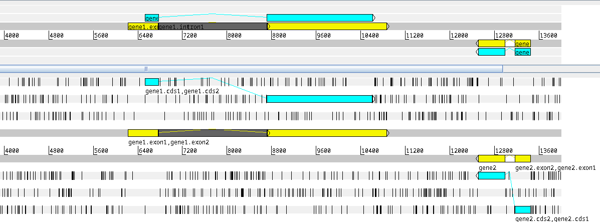


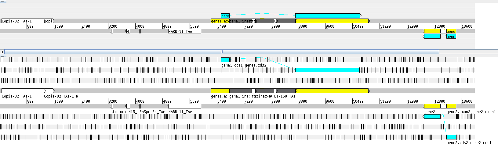

## Supplementary


- Whole Genome (all 7n chr) of _triticum aestivum_ on ENSEMBL : [https://ftp.ensemblgenomes.ebi.ac.uk/pub/plants/release-60/gff3/triticum_aestivum/](https://ftp.ensemblgenomes.ebi.ac.uk/pub/plants/release-60/gff3/triticum_aestivum/  )  
- ENSEMBL  in general : [https://plants.ensembl.org/Triticum_aestivum/Info/Index](https://plants.ensembl.org/Triticum_aestivum/Info/Index)  
- ENA: [https://www.ebi.ac.uk/ena/browser/view/Taxon:4565](https://www.ebi.ac.uk/ena/browser/view/Taxon:4565) 
- SRA: Sequence Read Archive, repository for seq data   
- RNAseq reads fetch and viz: [youtube video](https://www.youtube.com/watch?v=Wfxh9_fsRfo&t=330s)   
- RefSeq: reference sequence v2.1 [here](https://www.ncbi.nlm.nih.gov/datasets/genome/GCF_018294505.1/), link to acces the dataset is [_here_](https://api.ncbi.nlm.nih.gov/datasets/v2/genome/accession/GCF_018294505.1/download?include_annotation_type=GENOME_FASTA&include_annotation_type=GENOME_GFF&include_annotation_type=RNA_FASTA&include_annotation_type=CDS_FASTA&include_annotation_type=PROT_FASTA&include_annotation_type=SEQUENCE_REPORT&hydrated=FULLY_HYDRATED)  
- [downloading a proteome of a species from uniprot](https://www.ebi.ac.uk/training/online/courses/uniprot-exploring-protein-sequence-and-functional-info/when-to-use-uniprot-guided-example-clone/downloading-a-proteome-set-for-specific-organism/#:~:text=Go%20to%20the%20UniProt%20website,61%20Dataset%20selection%20drop%2Ddown.), EMBL-EBI training course  
- Chromosome 4D annotations in GFF [_ftp link_](https://ftp.ensemblgenomes.ebi.ac.uk/pub/plants/release-60/gff3/triticum_aestivum/Triticum_aestivum.IWGSC.60.chromosome.4D.gff3.gz)

<!-- ### Acknowledgements -->

[^1]:       | Accession     | Description                                                      |
    |---------------|------------------------------------------------------------------|
    | GAEF01000000  | Triticum aestivum, TSA project GAEF01000000 data                 |
    | GAJL01000000  | Triticum aestivum, TSA project GAJL01000000 data                 |
    | GBKH01000000  | Triticum aestivum, TSA project GBKH01000000 data                 |
    | GBKI01000000  | Triticum aestivum, TSA project GBKI01000000 data                 |
    | GBKJ01000000  | Triticum aestivum, TSA project GBKJ01000000 data                 |
    | GBKK01000000  | Triticum aestivum, TSA project GBKK01000000 data                 |
    | GBZP01000000  | TSA: Triticum aestivum, transcriptome shotgun assembly.          |
    | GDTJ01000000  | Triticum aestivum, TSA project GDTJ01000000 data                 |
    | GEUX01000000  | Triticum aestivum, TSA project GEUX01000000 data                 |
    | GEWU01000000  | Triticum aestivum, TSA project GEWU01000000 data                 |
    | GFFI01000000  | TSA: Triticum aestivum, transcriptome shotgun assembly.          |
    | GIJS01000000  | Triticum aestivum, TSA project GIJS01000000 data                 |
    | GILY01000000  | Triticum aestivum, TSA project GILY01000000 data                 |
    | GIXT01000000  | TSA: Triticum aestivum cultivar TcLr19 isolate leaf, transcriptome shotgun assembly. |
    | GJAR01000000  | TSA: Triticum aestivum cultivar Avocet R, transcriptome shotgun assembly. |
    | GJUY01000000  | TSA: Triticum aestivum, transcriptome shotgun assembly.          |
    | HAAB01000000  | Triticum aestivum, TSA project HAAB01000000 data                 |
    | HCEC01000000  | TSA: Triticum aestivum                                           |
    | HCED01000000  | TSA: Triticum aestivum                                           |
    | IAAK01000000  | TSA: Triticum aestivum, transcriptome shotgun assembly.          |
    | IAAL01000000  | TSA: Triticum aestivum, transcriptome shotgun assembly.          |
    | IAAM01000000  | TSA: Triticum aestivum, transcriptome shotgun assembly.          |


[^2]: Xiao, J., Jin, X., Jia, X., Wang, H., Cao, A., Zhao, W., ... & Wang, X. (2013). Transcriptome-based discovery of pathways and genes related to resistance against Fusarium head blight in wheat landrace Wangshuibai. BMC genomics, 14, 1-19.

[^3]:The Galaxy platform for accessible, reproducible, and collaborative data analyses: 2024 update
Nucleic Acids Research, gkae410
doi:10.1093/nar/gkae410

[^4]:The Galaxy server used for some calculations is partly funded by the German Federal Ministry of Education and Research BMBF grant 031 A538A de.NBI-RBC and the Ministry of Science, Research and the Arts Baden-Württemberg (MWK) within the framework of LIBIS/de.NBI Freiburg.

[^5]:The International Wheat Genome Sequencing Consortium (IWGSC) et al. ,Shifting the limits in wheat research and breeding using a fully annotated reference genome.Science361,eaar7191(2018).DOI:10.1126/science.aar7191

[^7]:EMBL-EBI training course on UniProt: [https://www.ebi.ac.uk/training/online/courses/uniprot-exploring-protein-sequence-and-functional-info/](https://www.ebi.ac.uk/training/online/courses/uniprot-exploring-protein-sequence-and-functional-info/when-to-use-uniprot-guided-example-clone/downloading-a-proteome-set-for-specific-organism/#:~:text=Go%20to%20the%20UniProt%20website,61%20Dataset%20selection%20drop%2Ddown.)

[^6]: Li, Heng, et al. "The sequence alignment/map format and SAMtools." bioinformatics 25.16 (2009): 2078-2079. 

[^8]:   | Chromosome | GenBank      | RefSeq        | Size (bp)   | GC content (%) | Unlocalized count | Action |
    |------------|--------------|---------------|-------------|-----------------|-------------------|--------|
    | 1A         | CM031178.1   | NC_057794.1   | 598,660,471 | 46              | 0                 |        |
    | 1B         | CM031179.1   | NC_057795.1   | 700,547,350 | 46              | 0                 |        |
    | 1D         | CM031180.1   | NC_057796.1   | 498,638,509 | 46.5            | 0                 |        |
    | 2A         | CM031181.1   | NC_057797.1   | 787,782,082 | 46              | 0                 |        |
    | 2B         | CM031182.1   | NC_057798.1   | 812,755,788 | 46              | 0                 |        |
    | 2D         | CM031183.1   | NC_057799.1   | 656,544,405 | 46.5            | 0                 |        |
    | 3A         | CM031184.1   | NC_057800.1   | 754,128,162 | 46              | 0                 |        |
    | 3B         | CM031185.1   | NC_057801.1   | 851,934,019 | 46              | 0                 |        |
    | 3D         | CM031186.1   | NC_057802.1   | 619,618,552 | 46.5            | 0                 |        |
    | 4A         | CM031187.1   | NC_057803.1   | 754,227,511 | 46              | 0                 |        |
    | 4B         | CM031188.1   | NC_057804.1   | 673,810,255 | 46.5            | 0                 |        |
    | 4D         | CM031189.1   | NC_057805.1   | 518,332,611 | 46.5            | 0                 |        |
    | 5A         | CM031190.1   | NC_057806.1   | 713,360,525 | 46              | 0                 |        |
    | 5B         | CM031191.1   | NC_057807.1   | 714,697,677 | 46              | 0                 |        |
    | 5D         | CM031192.1   | NC_057808.1   | 569,951,140 | 46.5            | 0                 |        |
    | 6A         | CM031193.1   | NC_057809.1   | 622,669,697 | 46              | 0                 |        |
    | 6B         | CM031194.1   | NC_057810.1   | 731,188,232 | 46.5            | 0                 |        |
    | 6D         | CM031195.1   | NC_057811.1   | 495,380,293 | 46.5            | 0                 |        |
    | 7A         | CM031196.1   | NC_057812.1   | 744,491,536 | 46              | 0                 |        |
    | 7B         | CM031197.1   | NC_057813.1   | 764,072,961 | 46              | 0                 |        |
    | 7D         | CM031198.1   | NC_057814.1   | 642,921,167 | 46.5            | 0                 |        |
    | MT         | EU534409.1   | NC_036024.1   | 452,526     | 44.5            | 0                 |        |
